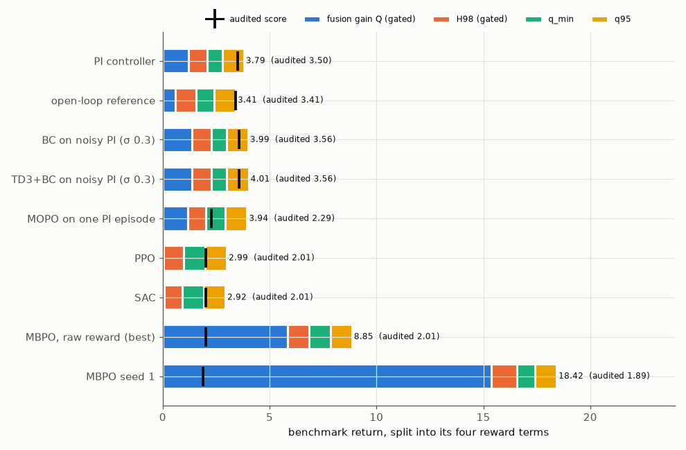

# rl-tokamak-rampup

Reinforcement learning for the ITER hybrid-scenario current ramp-up in [Gym-TORAX](https://github.com/antoine-mouchamps/gymtorax) (Mouchamps, Malherbe, Bolland, Ernst; [arXiv 2510.11283](https://arxiv.org/abs/2510.11283)), built on Google DeepMind's [TORAX](https://github.com/google-deepmind/torax) transport simulator. The benchmark asks an agent to set the plasma current and the NBI and ECRH heating once per second for 150 s; its paper reports a PI controller (3.79), the open-loop reference (3.40) and a random policy (−10.79), and no RL result. This repo reproduces those baselines on the paper's exact software stack, adds CPU-sized PPO, SAC, MBPO, behaviour cloning, TD3+BC and MOPO baselines with every checkpoint and trajectory committed, and wraps it in a literature review written for an RL researcher new to fusion.

**Literature review and results: <https://leandergrech.github.io/rl-tokamak-rampup/>**

## Results

| Policy | Benchmark return | Audited score | Simulator steps |
|---|---|---|---|
| PI controller (paper: 3.79) | 3.79 | 3.50 | – |
| Open-loop reference (paper: 3.40) | 3.41 | 3.41 | – |
| Random policy, 20 seeds (paper: −10.79) | 3.23 ± 0.06, 0 failures | – | – |
| PPO, seed 0 / seed 1 | 2.99 / 48.98 | 2.01 / 3.53 | 14,128 / 112,136 |
| SAC, seed 0 / seed 1 | 2.92 / 27.08 | 2.01 / 1.99 | 11,192 / 74,872 |
| MBPO, default reward, seeds 0–5 (final policies) | 2.08 – 18.42 | 1.89 – 2.96 | 1,480 – 3,775 |
| MBPO, full observation, seed 1 | 5.63 | 3.69 | 2,177 |
| MBPO trained on the audited reward, 3 seeds | −997.92, 2.98, 3.16 | −997.96, 2.98, 3.12 | ≈ 3,700 |
| TD3+BC on noisy PI logs (σ 0.3) | 4.01 | 3.56 | 0 online |
| CEM open-loop schedule, audited objective | 3.87 | 3.63 | 24,160 |
| PPO on PI (residual, audited reward), 5 seeds | 4.02–4.48 | **3.632 ± 0.037** | ≈ 30,000 each |
| PPO on PI, 2 long runs | 12.66 / 5.70 | **3.73 / 3.74** | 120,000 each |
| MBPO on PI (residual, audited reward), 5 seeds, final (best checkpoints) | 3.88–8.77 | **3.619 ± 0.070** (3.66–3.76) | ≈ 3,000 each (302–604 to beat PI) |

What this repo found:

1. **The published PI and open-loop numbers reproduce exactly on gymtorax 1.0.0 / TORAX 1.0.3; the random-policy number (−10.79) does not** (3.23 ± 0.06, no failures in 20 episodes), and the current gymtorax 1.1.1 changes all three ([details](https://leandergrech.github.io/rl-tokamak-rampup/01-problem/#which-version-is-the-benchmark)).
2. **The benchmark reward is exploitable.** Its fusion-gain term Q/10 is uncapped and its H-mode test is a core-temperature threshold under a time-scheduled pedestal, so switching the heating off after t = 105 s sends Q = P_fus/P_aux into the hundreds. A fixed open-loop sequence scores 22.74; MBPO, SAC and PPO found variants of it on their own (18.42, 27.08, 48.98) ([mechanism](https://leandergrech.github.io/rl-tokamak-rampup/05-limitations/#the-q-loophole-found-by-rl)).
3. **Under an audited score** (Q capped at 10, H-mode only while P_SOL ≥ P_LH), the best policy learned from scratch scores 3.69 against PI's 3.50 and the best open-loop schedule found 3.63: the real headroom above PI is a few tenths.
4. **RL on top of PI beats it without the loophole.** With the agent outputting a correction to the PI controller's action, trained and checkpointed on the audited score, PPO ends at 3.63 ± 0.04 audited over five seeds (every seed above PI's 3.50) after about 30,000 simulator steps, and MBPO passes PI after 302–604 steps (final 3.62 ± 0.07, best checkpoints 3.66–3.76). Two runs with four times the PPO budget reach 3.73 and 3.74, the best final scores here. Every agent heats during the ramp, which keeps q_min above 1 for up to 16 s longer ([how it works and where the design comes from](https://leandergrech.github.io/rl-tokamak-rampup/04a-rl-on-pi/)). The [Ramp-up Lab](https://leandergrech.github.io/rl-tokamak-rampup/primer/7-lab/) shows every controller's knobs live, separates feedback from open-loop control, and runs PI and the learned policies closed-loop on its own plasma.
5. A fork of Gym-TORAX with an additive `IterHybridAudited-v0` environment, tests and a baseline table is on [`leandergrech/gymtorax`, branch `fix/audited-iter-hybrid-reward`](https://github.com/leandergrech/gymtorax/tree/fix/audited-iter-hybrid-reward).



All numbers: [`data/results/summary.md`](data/results/summary.md). Upstream drafts (not opened): [`docs/upstream/issue.md`](docs/upstream/issue.md), [`docs/upstream/pr.md`](docs/upstream/pr.md).


## Quick start

Python 3.11–3.13 (tested on 3.12.3), CPU only.

```bash
git clone https://github.com/leandergrech/rl-tokamak-rampup && cd rl-tokamak-rampup
python3.12 -m venv .venv && . .venv/bin/activate
pip install torch --index-url https://download.pytorch.org/whl/cpu   # optional: avoids the CUDA wheels
pip install -e ".[dev]"
pytest                          # env sanity + a few-step smoke test of every baseline (~5 min)
bash scripts/reproduce.sh       # PI/open-loop vs the paper, re-evaluate all 44 checkpoints, rebuild table and figures (21 min on a laptop)
bash scripts/reproduce.sh --full  # retrain everything (each run < 2 h on a laptop CPU)
```

Train one baseline:

```bash
python scripts/train.py --algo mbpo --out data/runs/my_mbpo --real-episodes 20 --minutes 50
python scripts/train.py --algo ppo  --out data/runs/my_ppo  --n-envs 8 --minutes 45
python scripts/train.py --algo td3bc --dataset data/offline/pi_noisy_0.3.npz --out data/runs/my_td3bc
# residual RL: the agent corrects the PI controller, trained and checkpointed on the audited reward
python scripts/train.py --algo ppo  --residual pi --reward-mode patched --norm-reward --log-std-init -1 \
    --n-envs 5 --ppo-n-steps 64 --ppo-batch 64 --minutes 75 --out data/runs/my_ppo_res
python scripts/train.py --algo mbpo --residual pi --residual-scale 0.5 2 2 --reward-mode patched \
    --real-episodes 25 --minutes 75 --out data/runs/my_mbpo_res
python scripts/evaluate.py --summary
```

The environment wrapper is `rl_tokamak.env.RampupEnv` (flat 60-d observation, 3-d action [I_p ramp rate, P_NBI, P_ECRH], benchmark reward passed through in `info["benchmark_reward"]`). It changes only the interface; Gym-TORAX and TORAX are used unmodified. `rl_tokamak.residual.ResidualEnv` adds the PI controller underneath: the agent's action is a correction to PI's, and a zero correction is the PI episode.

## Pinned versions

`gymtorax==1.0.0`, `torax==1.0.3`, `jax==0.11.2`: the stack that reproduces the paper's numbers. The current gymtorax 1.1.1 (TORAX 1.4) changes the physics and the action semantics, and the paper's PI gains fail on it; see [the problem page](https://leandergrech.github.io/rl-tokamak-rampup/01-problem/#which-version-is-the-benchmark).

## Layout

```
docs/          the review (MkDocs Material, with interactive widgets in docs/javascripts/widgets.js and the Ramp-up Lab in
               lab.js, tokamak-model.js, lab-control.js), on GitHub Pages
src/rl_tokamak env wrapper, residual-on-PI env, PI/open-loop controllers, MBPO, TD3+BC, MOPO, SB3 runner, CEM, plotting
scripts/       train.py, evaluate.py, reproduce.sh, make_datasets.py, open_loop_search.py, make_figures.py,
               make_widget_data.py, profile_snapshots.py, score_upstream_envs.py, failure_probe.py, probe_versions.py,
               Ramp-up Lab: make_lab_data.py, export_lab_policies.py, make_lab_fixture.py, check_lab_control.mjs,
               calibrate_lab_model.mjs
notebooks/     01-explore, 02-baseline, 03-first-experiment
data/          offline datasets, trajectories, results, every run's config/curve/checkpoint (< 20 MB)
tests/         env sanity tests and baseline smoke tests
```

## Licence

MIT for this repo's code and text. Gym-TORAX (MIT), TORAX (Apache-2.0), Stable-Baselines3 (MIT) and other dependencies keep their licences; see [References](https://leandergrech.github.io/rl-tokamak-rampup/07-references/).
