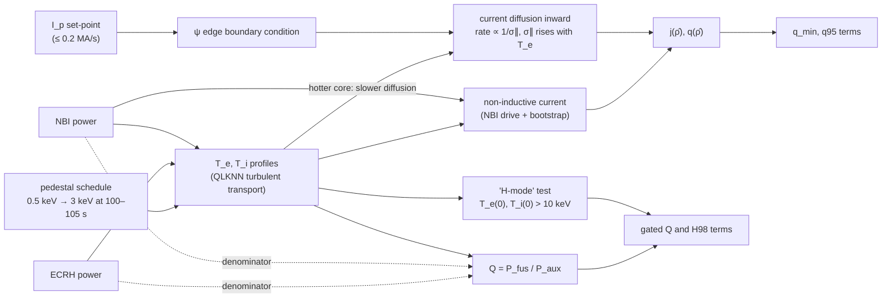
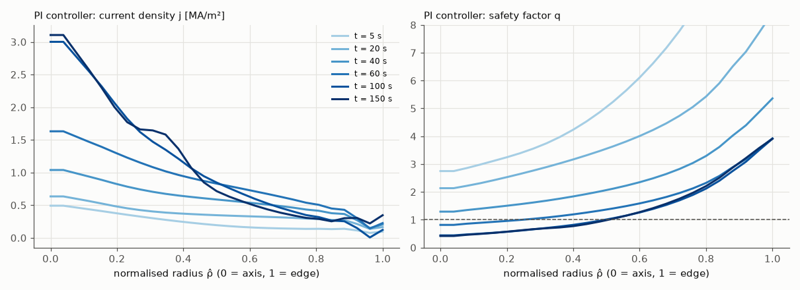

# Domain primer: tokamak current ramp-up for an RL researcher

This page is the physics you need to read the Gym-TORAX task critically: what the state variables mean, why the reward terms were chosen, what the simulator leaves out, and where the hard problems in fusion control are. It assumes nothing about plasma physics and everything about RL. Numbers from the simulator come from this repo's own rollouts (`data/trajectories/*.csv`); everything else links to [References](07-references.md).

## 1. The machine as a control system

A tokamak holds a ring (torus) of hydrogen plasma inside a vacuum vessel using magnetic fields. Core temperatures are tens of keV (1 keV ≈ 11.6 million K); the PI rollout in this repo reaches T_e(0) ≈ 27 keV. Two field components matter:

- the **toroidal field** B_φ, the long way round the ring, made by large superconducting coils and essentially fixed during a pulse (5.3 T at ITER's plasma centre, R = 6.2 m; [R3](07-references.md#r3), [R26](07-references.md#r26));
- the **poloidal field** B_θ, the short way round, made mainly by a current I_p flowing in the plasma itself (15 MA in ITER's baseline scenario; [R26](07-references.md#r26)).

Field lines wind helically around the torus. The plasma current is driven like the secondary of a transformer: a **central solenoid** in the hole of the torus ramps its own current, and the changing flux induces a loop voltage V_loop around the plasma. The solenoid can only swing its current so far, so each pulse has a finite **flux budget**, measured in volt-seconds. Spending it fast during the ramp-up leaves less for the flat-top; ITER's research plan says operation at 15 MA "requires the full capabilities of the central solenoid and optimization of the current ramp-up/down together with the use of additional heating" ([R27](07-references.md#r27)). Gym-TORAX does not model the solenoid or the flux budget; it takes I_p as a directly commanded boundary condition.

Heating sources on top of the ohmic (resistive) heating from I_p:

- **NBI** (neutral beam injection): beams of fast neutral atoms that ionise inside the plasma, heat it, fuel it, push it round toroidally, and drive some current. In Gym-TORAX: up to 33 MW, Gaussian deposition, current drive proportional to power.
- **ECRH / ECCD** (electron cyclotron resonance heating / current drive): microwaves absorbed where the wave frequency matches the electron gyrofrequency, which gives very localised heating and current drive whose radius can be steered. Up to 20 MW here.

Control in real tokamaks is layered: fast magnetic control of position and shape (kHz, the problem DeepMind solved on TCV), slower control of the current and pressure profiles and of the density (tens of ms to s), and a supervisory layer handling events and shutdown. The Gym-TORAX task sits in the second layer, at 1 s resolution.

## 2. The four state profiles and their PDEs

A tokamak plasma is, to a good approximation, constant on nested toroidal **flux surfaces**. Label each surface by a normalised radius ρ̂ ∈ [0, 1] (0 at the magnetic axis, 1 at the last closed flux surface). A 1.5D transport code such as TORAX then evolves four profiles on a radial grid while taking the 2D shape (the equilibrium) as given. In TORAX 1.0.3 the equations are ([R4b](07-references.md#r4b)); read them as "storage = divergence of flux + sources":

**Ion and electron heat** (T_i, T_e):

$$
\frac{3}{2} V'^{-5/3} \left(\frac{\partial }{\partial t}- \frac{\dot{\Phi}_b}{2\Phi_b}\frac{\partial}{\partial\hat{\rho}}\hat{\rho}\right)\left[V'^{5/3} n_{i,e} T_{i,e}\right] = \frac{1}{V'} \frac{\partial}{\partial \hat{\rho}} \left[\chi_{i,e}\, n_{i,e} \frac{g_1}{V'} \frac{\partial T_{i,e}}{\partial \hat{\rho}} - g_0\,q^{\mathrm{conv}}_{i,e} T_{i,e}\right] + Q_{i,e}
$$

**Electron density** (n_e):

$$
\left(\frac{\partial}{\partial t}- \frac{\dot{\Phi}_b}{2\Phi_b}\frac{\partial}{\partial\hat{\rho}}\hat{\rho}\right)\left[ n_e V' \right] = \frac{\partial}{\partial \hat{\rho}} \left[D_e \frac{g_1}{V'} \frac{\partial n_e}{\partial \hat{\rho}} - g_0 V_e n_e \right] + V' S_n
$$

**Poloidal flux** (ψ, which carries the current):

$$
\frac{16 \pi^2 \sigma_{\parallel}\mu_0 \hat{\rho}\, \Phi_b^2}{F^2} \left(\frac{\partial \psi}{\partial t}-\frac{\hat{\rho}\dot{\Phi}_b}{2\Phi_b}\frac{\partial \psi}{\partial \hat{\rho}}\right) = \frac{\partial}{\partial \hat{\rho}} \left( \frac{g_2 g_3}{\hat{\rho}} \frac{\partial \psi}{\partial \hat{\rho}} \right) - \frac{8\pi^2 V' \mu_0 \Phi_b}{F^2} \langle \mathbf{B} \cdot \mathbf{j}_{\mathrm{ni}} \rangle
$$

What the symbols mean for you:

- χ_i, χ_e, D_e are **turbulent diffusivities**. They are the hard part of plasma physics; TORAX computes them with QLKNN, a neural-network surrogate of a quasilinear gyrokinetic code ([R4](07-references.md#r4)). They depend steeply on local gradients (above a critical gradient, transport shoots up), which makes temperature profiles "stiff": pushing more power in raises T less than you would expect.
- Q_i, Q_e are heat sources (NBI, ECRH, ohmic, fusion alphas, ion-electron exchange, minus radiation). S_n is the particle source.
- V′, g₀…g₃, F, Φ_b are geometry from a precomputed equilibrium. In this environment they are fixed.
- σ_∥ is the parallel electrical **conductivity**, which rises steeply with electron temperature (roughly as T_e^{3/2}, the Spitzer scaling; textbook result, unverified here), and ⟨B·j_ni⟩ is the **non-inductive current**: bootstrap current (self-generated by pressure gradients) plus NBI and ECCD current drive.
- Boundary conditions: zero gradient at the axis; fixed edge values for T and n; for ψ, a derivative condition at the edge "which sets the total plasma current" ([R4b](07-references.md#r4b)).

The last point is the key to the ramp-up for an RL person. **Your I_p action is a Neumann boundary condition on a diffusion equation whose diffusivity is 1/σ_∥.** Current appears at the edge and diffuses inward on the resistive time, which is long when the plasma is hot (high σ_∥) and short when it is cold. Heating early "freezes" the current profile in place (slower penetration, broader or hollow current, higher central q); ramping fast relative to diffusion gives a hollow current profile; ramping slowly in a cold plasma lets current pile up in the centre (peaked current, low central q). Shaping q(ρ̂) during the ramp is the real control objective of a ramp-up, and the actuators act on it only through this diffusion.

The whole chain from actuators to reward, as the environment implements it:

The dotted arrows are the loophole [Limitations](05-limitations.md#1-the-benchmark-rewards-plasmas-that-would-not-be-operated) documents: auxiliary power sits in the denominator of the rewarded Q.

You can see the diffusion in this repo's PI rollout (`data/trajectories/pi.csv`): I_p goes from 3 MA to its 15 MA ceiling by t = 60 s at the maximum ramp rate, but the central current density keeps rising for another 90 s, from 0.41 MA/m² at t = 1 s to 3.0 MA/m² at t = 100 s and 3.1 MA/m² at t = 150 s.

The current profile peaks on axis as the ramp proceeds, and q on axis falls below 1 between t = 40 s and t = 60 s (data in `data/trajectories/profiles.npz`, from `scripts/profile_snapshots.py`).

## 3. The quantities in the reward, with the equations that matter

**Safety factor q.** The number of toroidal turns a field line makes per poloidal turn on a given flux surface. In a large-aspect-ratio circular approximation,

$$
q(r) \approx \frac{r\,B_\varphi}{R\,B_\theta(r)} = \frac{2\pi r^2 B_\varphi}{\mu_0 R\, I(r)},
$$

where I(r) is the current enclosed within radius r. More current inside r means lower q there. Two numbers summarise the profile:

- **q95**, q at the surface enclosing 95 % of the poloidal flux, is set mostly by total I_p and the shape. Low q95 risks disruptions (the usual rule of thumb is to stay above about 3; textbook value, unverified here), which is why the reward pays min(q95/3, 1). In the PI rollout q95 falls from 15.6 at t = 1 s to 3.31 at 15 MA.
- **q_min**, the minimum of q, usually on or near the axis. Where q < 1 the core is unstable to an internal kink that produces **sawteeth**: periodic crashes that flatten the central temperature and current every few seconds and can seed more dangerous modes (textbook description, unverified here). The reward pays min(q_min, 1).

**Normalised beta.** β = 2μ₀⟨p⟩/B² is plasma pressure relative to magnetic pressure. Its normalised form

$$
\beta_N = \beta_t\,\frac{a B_T}{I_p}\quad (\text{with } I_p \text{ in MA},\ a \text{ in m},\ B_T \text{ in T}; \text{ β in \%})
$$

([R28](07-references.md#r28)) is what ideal-MHD pressure limits (the Troyon limit) are expressed in. The environment's reward docstring mentions β_N but the implemented reward does not use it ([R3](07-references.md#r3)).

**Greenwald density limit.**

$$
n_G\,[10^{20}\,\mathrm{m^{-3}}] = \frac{I_p\,[\mathrm{MA}]}{\pi a^2\,[\mathrm{m^2}]}
$$

([R28](07-references.md#r28)). Line-averaged density above n_G (Greenwald fraction f_GW > 1) tends to end in a radiative collapse and a disruption ([R28](07-references.md#r28) reviews the evidence). For ITER at 15 MA and a = 2.0 m, n_G = 15/(π·4) ≈ 1.19 × 10²⁰ m⁻³. The Gym-TORAX reward has no density term; the PI rollout ends at f_GW = 1.19.

**Energy confinement time and H98.** τ_E = W_th / P_loss, the time the plasma would take to lose its thermal energy with the heating switched off. It is compared with an empirical scaling from a multi-machine database, IPB98(y,2) ([R29](07-references.md#r29)):

$$
\tau_{E}^{\mathrm{IPB98(y,2)}} = 0.0562\, I_p^{0.93} B^{0.15} n^{0.41} P^{-0.69} R^{1.97} \kappa^{0.78} \varepsilon^{0.58} M^{0.19}
$$

(I_p in MA, B in T, n in 10¹⁹ m⁻³, P in MW, R in m, κ elongation, ε = a/R, M ion mass in amu). **H98 = τ_E / τ_E^IPB98**. H98 ≈ 1 is standard H-mode; the hybrid scenario aims somewhat above 1. The reward pays min(H98, 1) in "H-mode". Note the I_p^0.93: more current, better confinement. That is the main reason every good policy in this benchmark drives I_p to its 15 MA ceiling.

**Fusion gain.** Q = P_fusion / P_aux, with P_aux the externally injected heating power. ITER's goal is Q ≥ 10 at 500 MW of fusion power for 50 MW injected ([R26](07-references.md#r26)); its long-pulse hybrid goal is Q = 5 for 1000 s ([R27](07-references.md#r27)). The reward pays (Q/10)/50 per second in "H-mode", which is uncapped.

## 4. L-mode, H-mode and the pedestal

Above a threshold heating power P_LH (which scales with density, field and size), a tokamak plasma spontaneously forms a thin edge transport barrier: the **pedestal**. Confinement improves markedly (by about a factor of two in typical cases; textbook value, unverified here); this is **H-mode**, as opposed to L-mode. The core temperature profile is stiff, so the core temperature largely rides on top of the pedestal: pedestal height sets core performance.

TORAX 1.0 does not predict the pedestal. It imposes it through "an adaptive source term which sets a desired value (pedestal height)" at a chosen radius ([R4b](07-references.md#r4b)). The Gym-TORAX ITER config prescribes pedestal temperatures of 0.5 keV until t = 100 s, rising to 3 keV at 105 s ([R3](07-references.md#r3)). Consequences for RL:

- the L-H transition happens at t = 100–105 s whatever the agent does, even if the heating is off (P_SOL < P_LH);
- the reward's "H-mode" test is not the pedestal but T_e(0) > 10 keV and T_i(0) > 10 keV. A policy that heats the core above 10 keV early is paid as if it were in H-mode, even with a 0.5 keV L-mode pedestal.

In the PI rollout the heating switches on at t = 99 s, the H-mode test first passes at t = 102 s, T_e(0) settles near 27 keV and Q reaches 14.6 by t = 150 s.

## 5. The ITER hybrid scenario

ITER's research plan has two main burning-plasma goals: Q = 10 at 15 MA for 300–500 s, and Q = 5 for about 1000 s at lower current, "based on the hybrid/improved H-mode scenario at q95 ~ 4" at 11.2 MA/5.3 T ([R27](07-references.md#r27)). A **hybrid scenario** runs at reduced current with a broad, low-shear central q profile held just above 1, so there are no sawteeth, confinement is better than standard H-mode, and more current is non-inductive, which stretches the flux budget. Getting there is largely a ramp-up problem: the q profile has to be shaped during the ramp with heating timing and current-drive placement, before the current profile relaxes. The non-RL state of the art on real machines is model-based optimisation of the ramp with RAPTOR, e.g. reaching "a stationary state with q_min > 1 at the beginning of the flat-top phase" on ASDEX Upgrade ([R15h](07-references.md#r15-timeline-sources)); the Gym-TORAX config says it is based "roughly" on that group's ITER hybrid work ([R3](07-references.md#r3)).

Hold that definition against the benchmark: its reference trajectory ramps to 12.5 MA, and the PI policy that sets the published baseline ramps to 15 MA and runs with q_min ≈ 0.41 for the last 100 s. By this environment's reward that is the better plasma; by the definition of a hybrid scenario it is not a hybrid scenario. [Limitations](05-limitations.md) quantifies this.

## 6. What the simulator leaves out

The Gym-TORAX paper says TORAX's hypotheses "limit its use to preliminary investigations" without listing them ([R1](07-references.md#r1)). Reading the TORAX paper and docs ([R4](07-references.md#r4), [R4b](07-references.md#r4b)) and the environment config ([R3](07-references.md#r3)), the gaps that matter for this task are:

| Missing or simplified | Effect on the RL problem |
|---|---|
| Pedestal prescribed in time, not predicted from power and density | L-H timing is not controllable; early heating cannot trigger H-mode, yet the reward's H-mode test can be met by a hot core |
| No sawtooth model enabled (TORAX 1.0.3 has a simple one; the env config does not use it) | q < 1 has no physical consequence; only the reward term min(q_min, 1)/150 notices |
| No tearing modes, no disruption model | nothing bad happens at f_GW > 1 or low q95 except via the bounds file |
| Fixed equilibrium geometry | shape and vertical position are not part of the problem; I_p changes do not change the shape |
| No central-solenoid flux budget or coil limits | the ramp costs nothing in volt-seconds |
| Deterministic, fixed initial state, no sensor noise | no need for state estimation; closed loop and open loop are equivalent in value |

## 7. Disruptions, and why control people care

A **disruption** is the sudden loss of confinement and current: a thermal quench followed by a current quench, both on millisecond timescales (textbook values, unverified here). In a machine the size of ITER it deposits large heat loads, induces eddy-current forces on the vessel, and can create beams of runaway electrons. Common triggers are exactly the regions the benchmark does not police: density above the Greenwald limit, low q95, large tearing modes (magnetic islands that grow at rational q surfaces), and vertical instability. Disruption *prediction* by deep learning is mature enough to transfer across machines (median warning times of 500–700 ms on DIII-D and about 1,000 ms on JET; [R15a](07-references.md#r15-timeline-sources)). Disruption *avoidance by control* is the open frontier (sections 8 and [Open questions](06-open-questions.md)).

## 8. What has been solved, and what has not

**Solved, on one machine: magnetic shape and position control with RL.** DeepMind and EPFL trained a single MPO policy that maps 34 flux loops, 38 magnetic probes and 19 coil currents to the voltages of all 19 TCV control coils at 10 kHz, and ran it on the real machine ([R6](07-references.md#r6)). Measured shape errors on hardware were 0.53–1.6 cm RMSE across the reported experiments, including an elongation of 1.9, negative triangularity −0.8, "droplet" double plasmas and a snowflake transition. Training used a licensed free-boundary simulator (FGE), 5,000 parallel actors and 1–3 days per policy. A follow-up improved shape accuracy by up to 65 % and cut training time for new tasks by a factor of 3 or more, again validated on TCV ([R7](07-references.md#r7)). RL magnetic or current control has since been reported on WEST, HL-3 and EAST ([R15j–l](07-references.md#r15-timeline-sources)).

**What that result did not do**, by its own account ([R6](07-references.md#r6)):

- **Start-up.** Breakdown and the early current rise were handled by the conventional controller; the policy took over at a "handover" time from a reconstructed equilibrium.
- **Disruption guarantees.** The controllers "are not guaranteed to avoid plasma disruptions"; the authors recommend a fallback controller or interlock.
- **Profiles.** Magnetic control shapes the boundary; it does not control the internal current, pressure or density profiles, which set performance and most disruption risks.
- **Transfer.** Each policy is trained for TCV's coils, sensors and simulator.

**Open: internal profile control.** The results that exist are data-driven and early: DIII-D tearing avoidance with DDPG on a learned model, described by its authors as "a proof-of-concept study" ([R8](07-references.md#r8)); feedforward β_N control on KSTAR ([R15c](07-references.md#r15-timeline-sources)); offline model-based RL for β_N and rotation on DIII-D ([R15e](07-references.md#r15-timeline-sources)); simulated q-profile and β_N control for JT-60SA ([R15f](07-references.md#r15-timeline-sources)); an offline-RL benchmark on 5,882 DIII-D shots where model-based offline methods lead but "no single method dominates all tasks" ([R13](07-references.md#r13)); and PPPL's PACMAN framework, which runs ML prediction and control in real time on DIII-D ([R9](07-references.md#r9)).

**Open: ramp-up and ramp-down.** RL for current ramp-up was studied in simulation for a DEMO-class device in 2019 ([R15b](07-references.md#r15-timeline-sources)); ramp-down trajectories designed with RL on learned dynamics have been tested on TCV ([R11](07-references.md#r11)) and simulated for SPARC ([R10](07-references.md#r10)). Gym-TORAX is the first open, pip-installable ramp-up benchmark, and it has no published RL result.

**Open: cross-device transfer and a common simulator.** Every control result above is trained on one machine's model. The open simulator (TORAX) is now used by DeepMind with Commonwealth Fusion Systems for SPARC ([R14](07-references.md#r14)), its maintainers plan "a more advanced control-oriented API", and UKAEA plans public ML benchmark cases for STEP ([R5](07-references.md#r5)). None of these was public on 30 September 2026.

## 9. Glossary

| Term | Meaning |
|---|---|
| ρ̂ | normalised toroidal-flux radius, 0 at the axis, 1 at the edge |
| I_p | total plasma current [MA] |
| j(ρ̂), j(0) | current density profile, and its central value [MA/m²] |
| q, q95, q_min | safety factor; its value at 95 % poloidal flux; its minimum |
| l_i(3) | internal inductance, a measure of how peaked the current profile is |
| β_N | normalised beta, pressure relative to field, scaled by I_p/(aB) |
| f_GW | Greenwald fraction n̄_e / n_G |
| τ_E, H98 | energy confinement time; its ratio to the IPB98(y,2) scaling |
| Q | fusion gain P_fus / P_aux |
| P_LH, P_SOL | L-H threshold power; power crossing the separatrix |
| NBI, ECRH, ECCD | neutral beam injection; electron cyclotron heating; electron cyclotron current drive |
| L-mode, H-mode, pedestal | low and high confinement regimes; the edge transport barrier of H-mode |
| sawtooth, tearing mode, disruption | core q < 1 relaxation; magnetic island at a rational surface; sudden loss of the plasma |
| QLKNN | neural-network surrogate for turbulent transport used by TORAX |
| RAPTOR, FGE | control-oriented transport code (EPFL); free-boundary equilibrium simulator used for TCV RL (licensed) |
