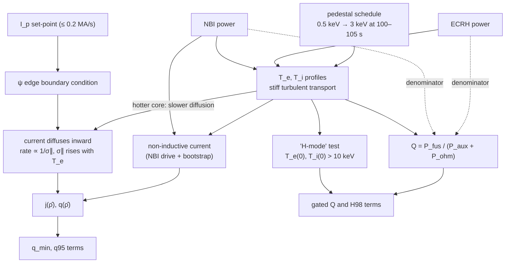

# :rt-primer: Domain primer: start here

!!! abstract "In short"

    - Eight short chapters take you from **the machine** to **the reward**, one physical idea each, and end in the **Ramp-up Lab**: a calibrated, in-browser reduced model of the benchmark that you can replay, drive and re-specify.
    - Every chapter follows the same pattern: a question, a picture you can play with, the equation, **what it means for the agent**, and links that open the Lab at the right moment.
    - All equations live on one [equation sheet](primer/equations.md), each with what TORAX does and what the Lab does instead.
    - The plasma current is driven at the edge and **diffuses inward**, slowly when the plasma is hot; **q** measures how field lines twist; **Greenwald fraction, β_N, H98 and Q** are the numbers the limits and the reward are written in; the simulator **prescribes the pedestal in time**, which is what makes the benchmark reward exploitable.

This primer is the physics you need to read the Gym-TORAX task critically and to redesign it: what the state variables mean, why the reward terms were chosen, what the simulator leaves out, and where the hard problems in fusion control are. It assumes nothing about plasma physics and everything about RL. Numbers from the simulator come from this repo's TORAX rollouts (`data/trajectories/*.csv`); everything else links to [References](07-references.md).

## How to use it

-   :rt-machine:{ .lg .middle } **[The machine](primer/1-machine.md)**

    ---

    What a tokamak is, as a control system: fields, the plasma current, the actuators, the layers of control. *Widget: the machine in 3D.*

-   :rt-q:{ .lg .middle } **[The safety factor q](primer/2-safety-factor.md)**

    ---

    How field lines twist, and why q = 1, 3/2, 2 and q95 matter. *Widget: one field line, live.*

-   :rt-current:{ .lg .middle } **[How the current gets in](primer/3-current-diffusion.md)**

    ---

    The I_p action is a boundary condition on a diffusion equation whose diffusivity depends on temperature. *Widgets: toy diffusion, real TORAX profiles.*

-   :rt-fusion:{ .lg .middle } **[Heat, confinement and fusion](primer/4-heat-and-fusion.md)**

    ---

    Stiff transport, the pedestal, IPB98 and H98, fusion power and Q. *Widgets: scalings, 0-D power balance.*

-   :rt-limits:{ .lg .middle } **[Limits and the operating space](primer/5-limits.md)**

    ---

    Greenwald, q95, β_N, the L–H threshold, sawteeth, disruptions, the hybrid scenario. *Widget: TORAX trajectories on the operating-space map.*

-   :rt-reward:{ .lg .middle } **[From physics to reward](primer/6-reward.md)**

    ---

    Each reward term traced back to its physics, the loopholes, and the levers a benchmark designer has. *Widgets: reward explorer, episode replay.*

-   :rt-lab:{ .lg .middle } **[The Ramp-up Lab](primer/7-lab.md)**

    ---

    All of the above in one simulator: presets that replay TORAX episodes with TORAX overlaid, a sandbox you drive one second at a time, and a reward you can redesign.

-   :rt-sigma:{ .lg .middle } **[Equation sheet](primer/equations.md)** and :rt-glossary:{ .lg .middle } **[Gaps, status and glossary](primer/8-field.md)**

    ---

    Every equation in one place; what the simulator leaves out; what the field has and has not solved; the vocabulary.

Reading time is about two hours with the widgets. If you only have twenty minutes: [How the current gets in](primer/3-current-diffusion.md), then open the Lab on the [PI controller](primer/7-lab.md?preset=pi) and the [heating cut](primer/7-lab.md?preset=heating_cut).

## The whole problem on one page

Over 150 s the controller raises the plasma current from 3 MA towards 12.5–15 MA and, from about 100 s, heats the plasma with up to 53 MW. The chain from actuators to reward, as the environment implements it (each box is covered in one of the chapters):

The dotted arrows are the loophole [Limitations](05-limitations.md#1-the-benchmark-rewards-plasmas-that-would-not-be-operated) documents: auxiliary power sits in the denominator of the rewarded Q, and the pedestal that keeps the core hot is scheduled rather than earned.

## A ramp-up in five moments

Open each moment in the Lab; the dashed lines there are TORAX, the solid ones the Lab model.

| t | What happens (PI controller, TORAX) | Why it matters | |
|---|---|---|---|
| 0 s | 3 MA, 3.7 keV on axis, q above 3 everywhere | the agent starts from the same state every episode | [open](primer/7-lab.md?preset=pi&t=1&tab=j){ .rt-try } |
| 51 s | q on axis drops below 1 | sawteeth in a real machine; only a small reward term notices | [open](primer/7-lab.md?preset=pi&t=51&tab=q&color=q){ .rt-try } |
| 61 s | I_p reaches its 15 MA ceiling | confinement scales as I_p^0.93: more current pays | [open](primer/7-lab.md?preset=pi&t=61&tab=q){ .rt-try } |
| 100–110 s | heating on, scheduled pedestal rises (100–105 s), core reaches 27 keV by about 110 s | the gated reward terms switch on at 102 s | [open](primer/7-lab.md?preset=pi&t=103&tab=T){ .rt-try } |
| 150 s | Q ≈ 14.6, q_min ≈ 0.41, Greenwald fraction ≈ 1.19 | a good score, but not a hybrid scenario and above the density limit | [open](primer/7-lab.md?preset=pi&t=151&tab=n){ .rt-try } |
