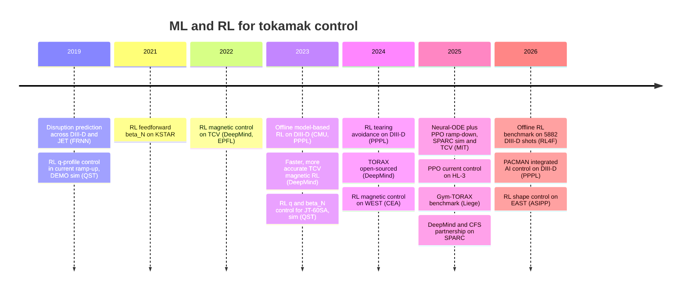

# :rt-timeline: Timeline 2018–2026

!!! abstract "In short"

    - 2019–2021: deep learning **predicts** disruptions across machines; first RL studies of q-profile and β_N control, mostly in simulation.
    - 2022: DeepMind and EPFL put an RL policy in the **10 kHz magnetic control loop** of TCV.
    - 2023–2026: profile-level control on DIII-D, KSTAR, HL-3, EAST and TCV, nearly always through a **learned dynamics model**; open simulators (TORAX) and benchmarks (Gym-TORAX, RL4F) appear.

Results in machine learning and reinforcement learning for tokamak control, with the headline number each paper reports. Every row links to the page that was opened; details and quotes are in [References](07-references.md). "Sim" means the result is in simulation only.

| Date | Group | Device | Method | Headline number | Link |
|---|---|---|---|---|---|
| 2019-04 | Princeton / PPPL (Kates-Harbeck, Svyatkovskiy, Tang) | DIII-D, JET | FRNN recurrent deep network, disruption *prediction* | median warning 500–700 ms on DIII-D, about 1,000 ms on JET, cross-machine | [Nature 568, 526](https://www.nature.com/articles/s41586-019-1116-4) |
| 2019-05 | QST (Wakatsuki et al.) | DEMO-class, sim | RL for q-profile control **during current ramp-up** | resistive flux consumption below 60 % of the Ejima-constant (0.45) estimate | [Nucl. Fusion 59, 066022](https://doi.org/10.1088/1741-4326/ab1571) |
| 2021-09 | Seoul National Univ. (Seo, Na et al.) | KSTAR | deep RL on an LSTM simulator, feedforward β_N | RL-designed scenarios validated in KSTAR experiments (no single accuracy number in the abstract) | [Nucl. Fusion 61, 106010](https://doi.org/10.1088/1741-4326/ac121b) |
| 2022-02 | DeepMind + EPFL SPC (Degrave et al.) | TCV | MPO, 91 magnetic measurements → 19 coil voltages at 10 kHz | shape RMSE 0.53–1.6 cm on hardware; 5,000 actors, 1–3 days training | [Nature 602, 414](https://www.nature.com/articles/s41586-021-04301-9) |
| 2023-01 | Princeton / PPPL (Abbate et al.) | DIII-D | NN dynamics model + finite-set MPC | simultaneous pressure and temperature control in experiment (no single number) | [J. Plasma Phys. 89, 895890102](https://doi.org/10.1017/S0022377822001040) |
| 2023-05 | QST (Wakatsuki et al.) | JT-60SA, sim | RL, q-profile + β_N | q_min held at 2–3 and β_N at 3 in ITB plasmas | [Nucl. Fusion 63, 076017](https://doi.org/10.1088/1741-4326/acd393) |
| 2023-06 | CMU + PPPL + GA (Char et al.) | DIII-D | offline model-based RL (PPO on learned model) | β_N = 1.75 and rotation targets reached in experiment | [L4DC, PMLR 211](https://proceedings.mlr.press/v211/char23a.html) |
| 2023-07 | DeepMind + SPC (Tracey et al.) | TCV | MPO with reward shaping, episode chunking, transfer | up to 65 % better shape accuracy, ≥ 3× faster training for new tasks | [arXiv 2307.11546](https://arxiv.org/abs/2307.11546) |
| 2023-09 | Univ. Naples (Dubbioso et al.) | ITER linear model, sim | DDPG vertical stabilisation | settling similar to model-based controller, lower voltage effort early | [Fusion Eng. Des. 194, 113725](http://wpage.unina.it/adriano.mele/docs/2023%20FED%20-%20A%20Deep%20Reinforcement%20Learning%20approach%20for%20VS.pdf) |
| 2024-01 | EPFL SPC + IPP (Van Mulders et al.) | ASDEX Upgrade | RAPTOR ramp-up optimisation (not RL) | stationary q_min > 1 at the start of flat-top | [Nucl. Fusion 64, 026021](https://doi.org/10.1088/1741-4326/ad1a55) |
| 2024-02 | Princeton / PPPL (Seo et al.) | DIII-D | DDPG on a learned β_N / tearability model | tearing avoided in experiment; authors call it "a proof-of-concept study" | [Nature 626, 746](https://pmc.ncbi.nlm.nih.gov/articles/PMC10881383/) |
| 2024-05 | Princeton + KSTAR (Kim, Shousha, Yang et al.) | DIII-D, KSTAR | ML surrogate + real-time 3D-field optimisation | fusion figure of merit up to +90 % in ELM-free plasmas | [Nat. Commun. 15, 3990](https://www.nature.com/articles/s41467-024-48415-w) |
| 2024-06 | Google DeepMind (Citrin et al.) | any, sim | TORAX: differentiable JAX transport simulator | ≈ 1 % NRMSD vs RAPTOR at steady state; 80 s ITER ramp-up in 6.5 s after 4.5 s compile | [arXiv 2406.06718](https://arxiv.org/abs/2406.06718) |
| 2024-09 | CEA IRFM (Kerboua-Benlarbi et al.) | WEST (hardware use unverified) | actor-critic RL on NICE free-boundary code | closed-loop magnetic control (no single number found) | [IEEE TPS 52](https://ieeexplore.ieee.org/document/10482855/) |
| 2025-06 | MIT PSFC (Wang, Rea et al.) | SPARC, sim | PPO on neural-ODE model (PopDownGym), transfer to RAPTOR | ramp-down from the 8.7 MA reference to below 2 MA; model trained on 336 of 481 RAPTOR runs | [Commun. Phys. 8, 231](https://www.nature.com/articles/s42005-025-02146-6) |
| 2025-10 | MIT + SPC (Wang, Pau et al.) | TCV | neural state-space model + RL trajectories, predict-first | ramp-down plasma current raised 20 %, 140 → 170 kA, in experiment | [Nat. Commun. 16, 8877](https://www.nature.com/articles/s41467-025-63917-x) |
| 2025-10 | HL-3 team (Wu, Yang, Li, Wei et al.) | HL-3 | PPO on a data-driven dynamics model | 400 ms at 1 kHz on hardware; current error 2.55 kA (0.85 % of 300 kA) | [Commun. Phys. 8, 393](https://www.nature.com/articles/s42005-025-02302-y) |
| 2025-10 | Univ. Liège (Mouchamps et al.) | ITER hybrid, sim | Gym-TORAX benchmark | PI 3.79, open-loop 3.40, random −10.79; no RL result | [arXiv 2510.11283](https://arxiv.org/abs/2510.11283) |
| 2025-10 | Google DeepMind + CFS | SPARC | TORAX + RL partnership | announced 16 Oct 2025 (no results yet) | [DeepMind blog](https://deepmind.google/blog/bringing-ai-to-the-next-generation-of-fusion-energy/) |
| 2026-05 | CSU, CMU, HKU et al. (Fu et al.) | DIII-D data | offline RL benchmark (RL4F), 13 algorithms | 5,882 shots; model-based offline methods lead, "no single method dominates" | [arXiv 2606.07550](https://arxiv.org/abs/2606.07550) |
| 2026-07 | PPPL (Rothstein et al.), PACMAN | DIII-D | integrated real-time ML prediction + control | tearing predicted about 200 ms ahead; five experiments; about 20 ms cycle | [Nucl. Fusion 66, 076050](https://doi.org/10.1088/1741-4326/ae7f9d), [news](https://www.sciencedaily.com/releases/2026/09/260903064215.htm) |
| 2026-07 | ASIPP (Zhang et al.) | EAST (hardware use unverified) | RL isoflux shape control vs PID | better disturbance rejection where PID saturates (no single number found) | [Nucl. Fusion 66, 086012](https://doi.org/10.1088/1741-4326/ae8313) |
| 2026-09 | this repo | ITER hybrid, sim | PI reproduction, PPO, SAC, MBPO, BC, TD3+BC, MOPO on Gym-TORAX 1.0.0 | see [Designs and results](04-designs.md) | — |

Rows marked "sim" are simulation-only. An RL policy ran in the real-time loop of a tokamak in Degrave et al. and Tracey et al. (TCV), Seo et al. 2024 (DIII-D) and the HL-3 paper. For the WEST and EAST papers the pages that could be opened did not say whether the policy ran on the machine (unverified). The remaining hardware rows use ML for prediction, as a surrogate inside a classical optimiser, or to design feedforward trajectories.

