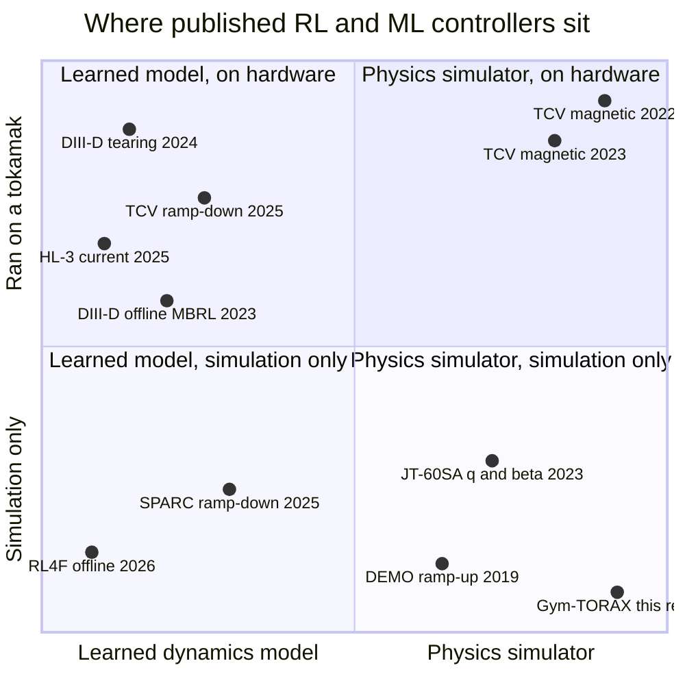
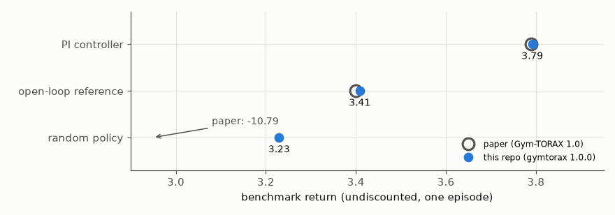
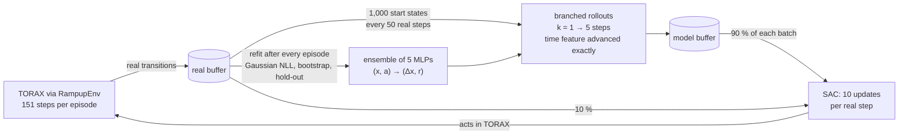
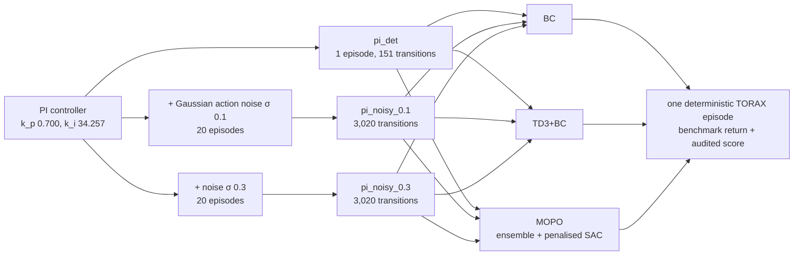
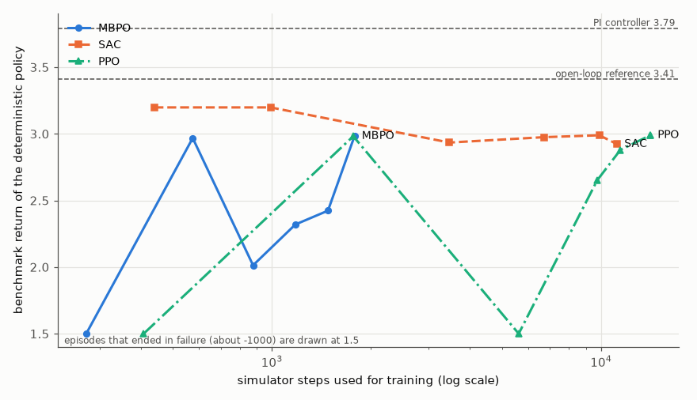
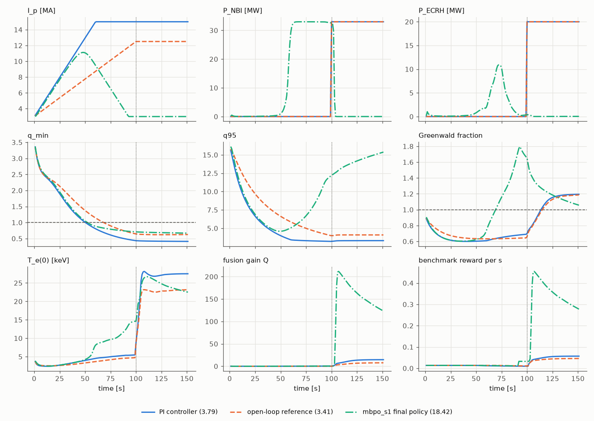
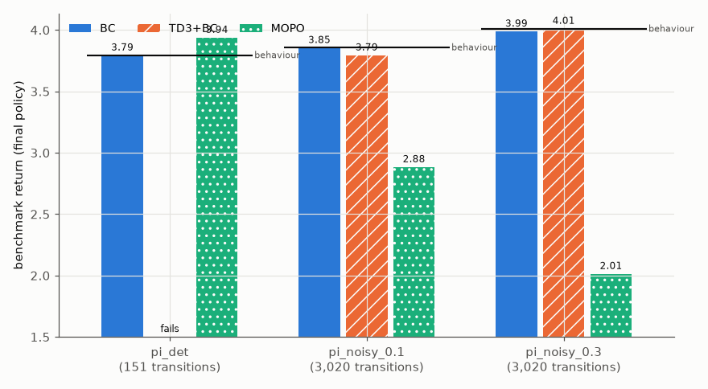

# Designs and results

Two parts: the published RL/ML control designs side by side, then this repo's baselines on Gym-TORAX with their numbers. Every literature number links to [References](07-references.md); every number of ours comes from a file under `data/`.

## Published designs side by side

| | DeepMind TCV magnetic control ([R6](07-references.md#r6), [R7](07-references.md#r7)) | DIII-D tearing avoidance ([R8](07-references.md#r8)) | MIT ramp-down ([R10](07-references.md#r10), [R11](07-references.md#r11)) | RL4F offline benchmark ([R13](07-references.md#r13)) | Gym-TORAX ([R1](07-references.md#r1), [R3](07-references.md#r3)) |
|---|---|---|---|---|---|
| Control problem | plasma current, position and boundary shape after handover | keep β_N high while keeping predicted tearability below a threshold | ramp I_p down safely | track rotation, density, temperature, pressure profiles | ramp-up to a high-performance flat-top |
| Algorithm | MPO (actor-critic), asymmetric: small feedforward actor, LSTM critic | DDPG (Keras-RL) | PPO | 13 offline algorithms incl. MOPO, COMBO, RAMBO, TD3+BC, CQL, IQL | none yet (PI, open-loop, random baselines) |
| Dynamics used for training | FGE free-boundary simulator, licensed from EPFL | learned model of β_N and tearability from DIII-D data | PopDownGym: neural ODE trained on 336 RAPTOR runs | learned DIII-D dynamics model from 5,282 training shots | TORAX 1D transport PDEs, QLKNN transport |
| Observation | 34 flux loops, 38 field probes, 19 coil currents (+1 derived) | 5 profiles × 33 grid points | 8-dimensional | profiles + scalars (per task) | full profiles and scalars (1,735 numbers) |
| Action | 19 coil voltages at 10 kHz | total beam power, boundary triangularity | 4-dimensional | per task | I_p set-point, NBI and ECRH power and deposition, 1 Hz |
| Reward | per-target error → [0, 1] via nonlinear map, weighted combination | β_N reward, penalty when predicted tearability exceeds k ∈ {0.2, 0.5, 0.7} | reach I_p < 2 MA while respecting limits | negative tracking error | fusion gain, H98 (both gated on T > 10 keV), q_min and q95 terms; −1000 on failure |
| Compute | 5,000 actors, 1–3 days per policy on a TPU learner | not stated on the opened page (unverified) | not stated on the opened page (unverified) | several to about 30 GPU-hours per method (MOPO about 11 h) | benchmark episode about 17 s on one CPU core in this repo |
| Reported result | shape RMSE 0.53–1.6 cm on hardware; up to 65 % more accurate and ≥ 3× faster training in the follow-up | tearing avoided in DIII-D discharges; "proof-of-concept" | SPARC simulation study; on TCV, a predict-first ramp-down raised I_p 20 % (140 → 170 kA) | model-based offline RL best on average; MOPO most robust; no single winner | PI 3.79 > open-loop 3.40 > random −10.79 |
| What transferred to hardware | yes, zero-shot from simulator | yes, from learned model | TCV experiments for the NSSM + RL design; SPARC not built | no (evaluated on a learned simulator) | no (simulation only) |

Placement is qualitative (from the table above and [the timeline](03-timeline.md)): the x-axis is what the policy was trained against, the y-axis whether a learned policy ran on a real machine. WEST and EAST are left out because the opened pages did not settle whether their policies ran on hardware.

Three design patterns stand out.

1. **Where a trustworthy simulator exists, model-free RL with massive parallelism works.** TCV's FGE is a free-boundary equilibrium code whose magnetic dynamics are close enough to reality for zero-shot transfer, and DeepMind paid for it with 5,000 actors.
2. **Where physics models are poor (tearing, profiles), every hardware result trains on a learned model.** DIII-D tearing avoidance, the TCV ramp-down and the offline DIII-D results all put a neural dynamics model between the data and the policy. This is why this repo's model-based baseline matters: it is the family that has reached hardware for profile-level problems.
3. **Rewards are shaped constraints.** Every design encodes limits (tearability, disruptivity, q, shape error) as reward terms or terminations rather than as hard constraints; none offers guarantees, and DeepMind says so explicitly.

## This repo's baselines

All runs use gymtorax 1.0.0 / torax 1.0.3 (the paper's stack, see [The control problem](01-problem.md#which-version-is-the-benchmark)), the wrapper defaults (60-dimensional `profiles` observation, 3-dimensional action [I_p ramp rate, P_NBI, P_ECRH], training reward = 100 × benchmark reward with failure → −100) unless an ablation says otherwise, and are scored with the benchmark's own undiscounted return of one deterministic episode.

### Classical baselines reproduced

`python scripts/evaluate.py --classical` (output `data/results/classical.json`):

| Policy | Paper (v1.0) | This repo | Notes |
|---|---|---|---|
| PI controller, k_p = 0.700, k_i = 34.257 (re-implemented in `rl_tokamak.controllers`) | 3.79 | **3.7919** | identical to Gym-TORAX's own `PIDAgent` (3.791923 both) |
| Open-loop reference (I_p 3 → 12.5 MA over 100 s, 33 MW NBI + 20 MW ECRH from 99 s) | 3.40 | **3.4086** | |
| Random (uniform over the Gym-TORAX action dict), 20 seeds | −10.79 | **3.23 ± 0.06**, 0 failures | **not reproduced**: see below |

The paper's random-policy mean is not reproduced. A uniform random policy never triggered the −1000 failure in 20 episodes here (returns 3.10–3.33). The paper's −10.79 would follow from a failure rate of about 1.4 % with otherwise similar returns; the number of episodes and seeds behind it is not stated in the paper ([R1](07-references.md#r1)), and small numerical differences in the JAX stack can decide whether a marginal state leaves the bounds file. Report random-policy numbers with their failure rate.

Where the PI controller's advantage over the open-loop reference comes from (sum of each reward term over the episode):

| Reward term | PI | Open-loop |
|---|---|---|
| fusion gain (H-mode gated) | 1.19 | 0.60 |
| H98 (H-mode gated) | 0.90 | 0.96 |
| q_min | 0.69 | 0.83 |
| q95 | 1.01 | 1.01 |
| **total** | **3.79** | **3.41** |

The PI policy wins entirely on fusion gain, by reaching 15 MA at t = 60 s, and pays for it with q_min (0.41 at the end).

### Baseline designs

All learned policies see the wrapper defaults unless an ablation says otherwise: 60-dimensional `profiles` observation with fixed normalisation, action [I_p ramp rate, P_NBI, P_ECRH] ∈ [−1, 1]³ (deposition fixed at the reference), I_p floor 3 MA, training reward 100 × benchmark reward with failure → −100, γ = 0.995.

| Baseline | Implementation | Networks | Key settings | Budget |
|---|---|---|---|---|
| PPO | Stable-Baselines3 2.9.0 | MLP 64-64 (actor and critic) | 8 envs, n_steps 128, batch 256, 10 epochs, lr 3e-4, GAE λ 0.95, clip 0.2, initial log σ −0.5 | 45 min wall clock |
| SAC | Stable-Baselines3 2.9.0 | MLP 256-256 | 8 envs, 1 gradient step per transition, buffer 300k, 3k warm-up steps, automatic entropy | 45 min wall clock |
| MBPO | `rl_tokamak.agents.mbpo` | ensemble of 5 Gaussian MLPs 3×200 (SiLU), bootstrapped, 10 % hold-out early stopping; SAC 256-256 | model refit after every episode; every 50 real steps branch 1,000 rollouts of length k = 1 → 5 (ramped over episodes 4–20); 10 SAC updates per real step on 10 % real + 90 % model data; time feature advanced exactly | 20–30 simulator episodes, 50–55 min cap |
| BC | `rl_tokamak.agents.offline` | MLP 256-256, tanh output | MSE to logged actions | 60k (pi_det) or 20k steps, 25 min cap |
| TD3+BC | `rl_tokamak.agents.offline` | 256-256 actor and twin critics | α = 2.5, policy noise 0.2, delay 2, dataset state normalisation ([R21](07-references.md#r21)) | same |
| MOPO | `rl_tokamak.agents.offline` | MBPO's ensemble and SAC | penalty λ = 1 on max-member predictive σ norm, horizon 5, 5 % real data ([R20](07-references.md#r20)) | same |
| CEM open-loop search | `rl_tokamak.agents.cem` | none | 9-parameter schedule (two ramp rates and switch time, I_p ceiling, pre-heating power and start, flat-top powers), population 12, 4 elites | 45 min, 4 workers |

How the MBPO baseline spends simulator steps:

And how the offline experiment is built:

Offline datasets (`scripts/make_datasets.py`, summary in `data/offline/datasets.json`): `pi_det` is one deterministic PI episode (151 transitions; more episodes would be identical); `pi_noisy_0.1` and `pi_noisy_0.3` are 20 PI episodes each with Gaussian action noise of 0.1 or 0.3 (I_p noise in units of the 0.2 MA/s ramp limit, power noise in units of the maximum power), 3,020 transitions each. Their behaviour returns are 3.79, 3.85 ± 0.01 and 4.01 ± 0.03.

### Results

<!--RESULTS_TABLE-->

"Return" is the benchmark score of the final policy (one deterministic episode). "Best during training" is the highest deterministic evaluation seen during training; with a deterministic environment and no held-out test set, it is selected on the benchmark itself and should be read as an optimistic anytime number. "Sim. steps to beat PI" is the number of simulator steps used for training when a deterministic evaluation first exceeded 3.7919. Wall times were measured on a 16-thread laptop CPU that was **shared with two other heavy workloads** for most of the session (load average 20–40); on an idle machine the same runs are 3–10× faster, so the step counts, not the minutes, are the comparable quantity.

<!--RESULTS_DISCUSSION-->
