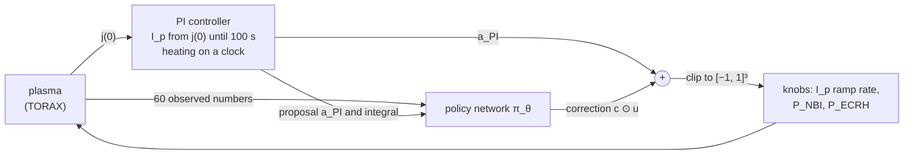
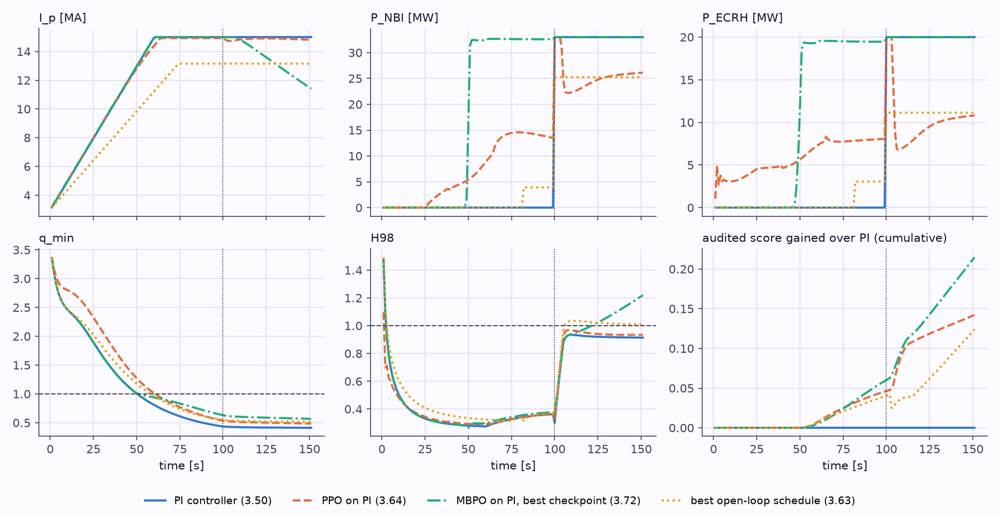

# :rt-residual: RL on top of PI

!!! abstract "In short"

    The learned policies on this page do not choose the plasma current and the heating. They choose a **correction** to what the paper's PI controller would do, and the action sent to TORAX is PI's action plus that correction. A zero correction is exactly the PI episode, so learning starts at the published bar instead of at 3 MA with the heating off. Trained and checkpointed on the audited score, PPO on PI ends at 3.64 on both seeds against PI's 3.50, and MBPO on PI passes PI within 302–604 simulator steps (best checkpoint 3.72). The design is **residual reinforcement learning**, introduced for robot control in 2018 ([R31](07-references.md#r31), [R32](07-references.md#r32)). Using it here was this repo's choice, made after the from-scratch agents failed; the sources checked for this review contain no tokamak scenario controller built this way.

## Why not RL from scratch

Every from-scratch agent in this repo that was trained on the audited score ended below PI (MBPO: 2.98, 3.16 and a bounds failure; [Designs and results](04-designs.md#what-the-numbers-say)). Three properties of the ramp-up make that likely:

1. **The first 100 s reward a low current.** Before the scheduled pedestal only the q_min and q95 terms pay, and both are largest when I_p stays low. Holding 3 MA collects about 2.0 over the episode, which is where PPO, SAC and MBPO kept landing.
2. **Credit arrives late.** The gated terms after 100 s need a hot, high-current plasma, so the decision that earns them (ramp the current, and how fast) is taken 60–100 s before the reward that pays for it.
3. **Simulator steps are expensive.** TORAX runs about 3 steps per second per CPU core, so an hour buys a few hundred episodes, too few to discover the ramp by random exploration.

A correction on top of PI removes the first two problems instead of solving them: PI already ramps the current, and the agent only has to learn what to change.

## How the controller is built



Every second, PI proposes an action from its own measurement, the network sees the plasma and PI's proposal, and the two are added:

\[
a_t = \operatorname{clip}\!\big(a^{\rm PI}_t + c \odot u_t,\; -1,\; 1\big), \qquad u_t = \pi_\theta(o_t) \in [-1, 1]^3, \qquad o_t = \big[\,x_t,\; a^{\rm PI}_t,\; k_i \textstyle\int e\,dt \,/\, 10\ \mathrm{MA}\,\big]
\]

Here x_t is the usual 60-number observation of [the control problem](01-problem.md) and the actions are in the wrapper's normalised units: the I_p ramp rate in units of the 0.2 MA/s limit, and each power from −1 (off) to +1 (full). During the ramp PI proposes +1 for I_p (it rides its rate limit) and −1 for both powers (heating off until 99 s); after 100 s it proposes 0 for I_p (hold) and +1 for both powers.

The scale c decides how far from PI the agent can go:

| Knob | Scale c | What the agent can do |
|---|---|---|
| I_p ramp rate, PPO | 1 | slow PI's ramp to a stop, or after 100 s move I_p at up to ±0.2 MA/s |
| I_p ramp rate, MBPO | 0.5 | at most halve PI's ramp (I_p still ends above 13 MA); after 100 s ±0.1 MA/s |
| P_NBI, P_ECRH | 2 | any power from either of PI's levels: add heating during the ramp, trim it in the flat-top |

Five details make it work, each for a reason found the hard way:

- **A zero correction is the PI episode.** With u = 0 the episode reproduces PI's benchmark 3.7919 and audited 3.5016 to four decimals (PI's proposal passes through the float32 action vector, so I_p agrees to about 10⁻⁸ relative). Learning therefore starts at the bar it has to beat, and every improvement is measured from it.
- **PI rate-limits against the applied current.** When the agent slows the ramp, PI's own idea of the current would run ahead of the real one and the gap would become hidden state. Resetting PI's reference to the applied current every second (bumpless transfer, in control terms) removes it.
- **The observation carries PI's state.** PI's proposal and its integral of the j(0) error are appended to the 60 observed numbers, so the agent can predict what PI will do next and the problem stays Markov.
- **The policy starts at zero.** PPO's action head is initialised near zero with log σ = −1; MBPO's actor output layer is zeroed with log σ = −1 and an entropy weight of 0.1. The first episodes are PI episodes with small perturbations, not random actions.
- **It learns the audited score.** On the benchmark reward the correction would discover the heating cut of [Limitations](05-limitations.md#the-q-loophole-found-by-rl) (trimming flat-top power inflates Q without bound). The training reward is the audited one (Q ≤ 10, H-mode only while P_SOL ≥ P_LH), and the checkpoint kept is the one with the best audited score.

Each algorithm needed more. PPO normalises the training reward (otherwise its value loss dominates the clipped gradient) and updates every 64 steps per worker. MBPO gives its model rollouts what is known exactly instead of learned: the time, PI's clock-driven proposals, the reward formula applied to the predicted state, and Gym-TORAX's bounds rule (T ≤ 35 keV, q ≤ 100). [Designs and results](04-designs.md#what-the-numbers-say) (item 7) lists the failed attempt behind each of these.

## What it learned

| Policy | Benchmark | Audited | Simulator steps |
|---|---|---|---|
| PI controller | 3.79 | 3.50 | – |
| Best open-loop schedule (CEM, audited objective) | 3.87 | 3.63 | 24,160 |
| PPO on PI, seeds 0 / 1, final policies | 4.47 / 4.02 | **3.64 / 3.64** | 29,535 / 29,390 |
| MBPO on PI, seeds 0 / 1, final policies | 3.88 / 6.59 | 3.51 / 3.63 | 3,020 each |
| MBPO on PI, seeds 0 / 1, best checkpoints | 3.92 / 6.36 | **3.72** / 3.66 | above PI after 302 / 604 |

Two seeds per algorithm; the full table, the learning curves and the failed attempts are in [Designs and results](04-designs.md#what-the-numbers-say), item 7.

Both PPO seeds learned the same correction: **heat during the ramp, then trim the flat-top heating**. Seed 0 adds a few MW of ECRH from the first second and NBI from 28 s; seed 1 mostly NBI. A hotter plasma conducts better, so the current reaches the core later: q_min stays above 1 until about 61 s instead of 51 s. After a three-second burst at full power while the scheduled pedestal rises, seed 0 settles at about 22 MW of NBI and 7 MW of ECRH, enough to keep P_SOL above P_LH. This is the hybrid-scenario recipe (heating early to shape the current profile) found from the reward alone. MBPO's best checkpoint heats fully from 50 s and ramps I_p down in the flat-top, which raises H98 partly because H98's yardstick τ_98 ∝ I_p^0.93 falls with the current.

<figure markdown="span">
  
  <figcaption><strong>The corrections, knob by knob,</strong> against PI and the best open-loop schedule. Bottom right: audited score gained over PI by time t; most of it comes after 50 s, through q_min.</figcaption>
</figure>

The [Ramp-up Lab](primer/7-lab.md?preset=ppo_res&t=60) shows the same episode second by second: in its knobs panel PI's proposal is the dashed pink needle and the network's correction the pink arc and shading. Switched to *live*, the network reads the Lab's plasma instead of TORAX's and still beats PI there (audited 3.48 against 3.33), with its margin intact when the transport is changed ([robustness table](primer/7-lab.md#open-loop-and-feedback)).

## Where the design comes from

**Residual reinforcement learning.** Johannink et al. ([R31](07-references.md#r31)) built robot controllers in which "the final control policy is a superposition of both control signals": a conventional feedback controller and "the residual which is solved with RL". Silver et al. ([R32](07-references.md#r32)) proposed the same idea independently in the same year: "learning a residual on top of the initial controller can yield substantial improvements". Both start from the same observation as this page: a reasonable controller already exists, so learn only what it gets wrong.

**In plasma control.** The RL controllers in this review's [timeline](03-timeline.md) mostly replace the classical controller ([R6](07-references.md#r6) on TCV) or supply feedforward commands (KSTAR, [R15c](07-references.md#r15-timeline-sources)). The EXL-50U vertical-control work ([R33](07-references.md#r33)) combines the two in the opposite direction, adding "lightweight integral compensation" to an RL policy. In the sources checked for this review, and in searches for residual RL with tokamak or plasma control, no tokamak scenario controller built as an RL correction on top of a PI controller turned up. That is a statement about this search, not proof that none exists.

**Why here.** It was chosen in this repo on 1 October 2026, after the audited-reward MBPO runs stayed below PI, because the three obstacles above are exactly the ones a residual design removes. Nothing in Gym-TORAX suggests it; the benchmark's PI baseline simply made it available.

## What it is not

- **Not RL from scratch.** The agent can only move a bounded distance from PI, and it inherits PI's structure: a j(0) target that rises to 2 MA/m² and a heating clock. A policy far from PI (a slow ramp to 10 MA with heating from 10 s, say) is out of reach for MBPO's settings and hard to reach for PPO's.
- **Not a robustness result.** The environment has one fixed initial state and is deterministic, so each score is one episode, the best checkpoint is selected on the same episode it is scored on, and nothing here tests a plasma that differs from the one trained on. That is [Open question 3](06-open-questions.md#3-does-feedback-matter-a-randomised-gym-torax).
- **Not free of the benchmark's flaws.** The audited score still pays for H98 against a yardstick that falls with I_p, which MBPO's best checkpoint uses.

## Code

`src/rl_tokamak/residual.py` (`ResidualEnv`; `ResidualAdvance` for MBPO's rollouts), selected by `--residual pi` in `scripts/train.py`; tests in `tests/test_residual.py`.

```bash
python scripts/train.py --algo ppo  --residual pi --reward-mode patched --norm-reward --log-std-init -1 \
    --n-envs 5 --ppo-n-steps 64 --ppo-batch 64 --minutes 75 --out data/runs/my_ppo_res
python scripts/train.py --algo mbpo --residual pi --residual-scale 0.5 2 2 --reward-mode patched \
    --real-episodes 20 --minutes 75 --out data/runs/my_mbpo_res
```
