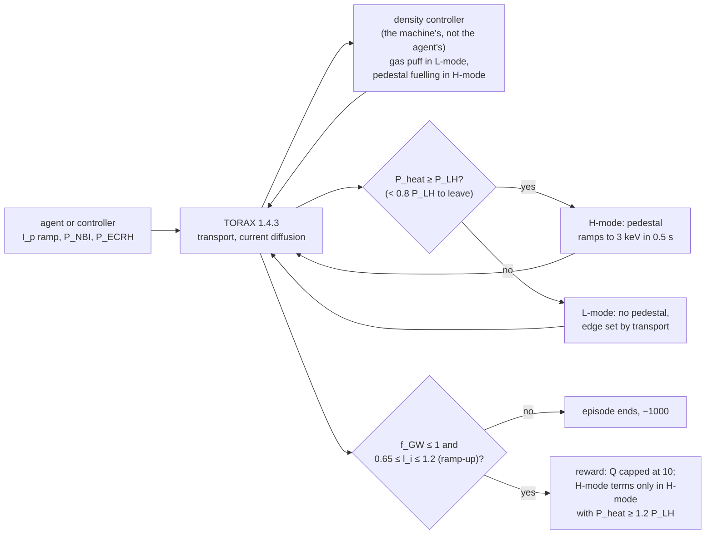
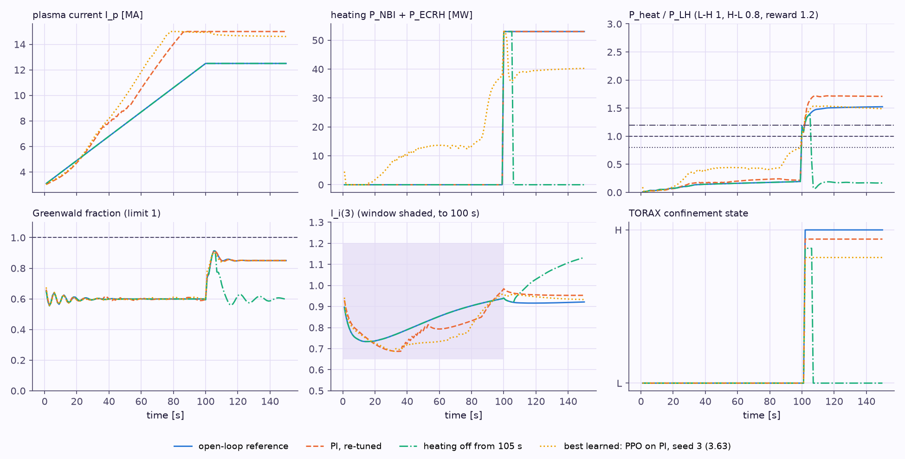
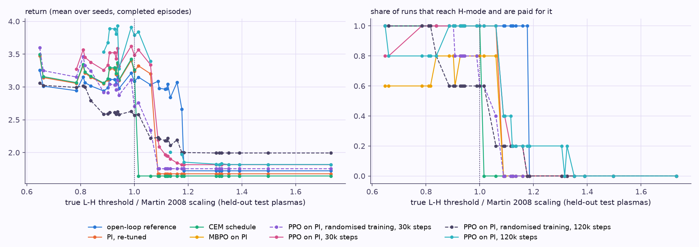

# :rt-limits: A physics-consistent ramp-up

!!! abstract "In short"

    Gym-TORAX switches the H-mode pedestal on by the clock, at 100–105 s, whatever the heating. That is why "heat, then switch the heating off" scores 20.96 instead of 3.26, and why a plasma that is never heated still gets H-mode. TORAX 1.4 can instead form the pedestal only when the heating power exceeds the L-H threshold, and drop it when the power falls. **`rl_tokamak.physics`** uses that model and adds three things: density control (the configuration has no fuelling of its own), two operating limits that end the episode (the Greenwald density limit, and the internal inductance window that ITER's vertical control needs), and a reward that pays for H-mode only when TORAX is in H-mode with a 20 % power margin. It runs on gymtorax 1.1.1 / TORAX 1.4.3 at the same cost per episode. The benchmark results on gymtorax 1.0.0 are untouched.

    On it, the paper's PI gains break the inductance window within 9 s; re-tuned, PI scores 3.24 and the best open-loop schedule found 3.26. **PPO on PI reaches 3.49 ± 0.14 over five seeds, every seed above PI**, by heating during the ramp, as on the benchmark. MBPO on PI first learned to trim the heating below the L-H threshold, because its learned model kept H-mode without the power; with TORAX's L-H rule applied inside its model rollouts it beats PI in 3 of 5 seeds.

    Across 33 held-out plasmas drawn from the measured uncertainty, the true L-H threshold decides almost everything: 9 % above the scaling, PI and every policy running near 15 MA lose H-mode, while the 12.5 MA open loop keeps it to 18 %. Training on randomised plasmas mostly taught agents to stay at low current, which the reward, like the benchmark's, allows; the next version should require the flat-top current.

## Why the scheduled pedestal had to go

In a tokamak the pedestal (the steep edge gradient that defines H-mode) only forms after an L-H transition, and the transition needs the power crossing the plasma edge to exceed a threshold P_LH that grows with density, magnetic field and plasma surface ([R35](07-references.md#r35)). If the power later falls well below the threshold the plasma returns to L-mode and loses its pedestal ([R38](07-references.md#r38)). [Heat, confinement and fusion](primer/4-heat-and-fusion.md) explains the physics.

Gym-TORAX's ITER hybrid configuration prescribes the pedestal-top temperature in time instead: 0.5 keV until 100 s, rising to 3 keV at 105 s. The same action sequences on the same simulator (gymtorax 1.1.1 / TORAX 1.4.3), with only the pedestal model changed and the unchanged `IterHybrid-v0` reward (`scripts/probe_pedestal_formation.py`, `data/results/pedestal_formation_probe.json`):

| Same actions | Scheduled pedestal | Power-triggered pedestal |
|---|---|---|
| Open-loop reference | 3.26, pedestal from 104 s | 3.43, pedestal from 101 s (when the 53 MW heating starts) |
| Heating off from 105 s | **20.96**, pedestal kept, Q up to 244 | **2.48**, pedestal lost within 2 s |
| No heating at all | **12.62**, pedestal from 104 s anyway | **1.69**, never H-mode |

The loophole of [Limitations](05-limitations.md#the-q-loophole-found-by-rl) disappears in the dynamics, not only in the score: without heating there is no H-mode to pay for.

## What the environment changes



1. **Pedestal.** TORAX's formation model ([R34](07-references.md#r34)) with the Martin 2008 threshold, TORAX's default hysteresis (H-L below 0.8 P_LH) and its default 0.5 s ramp. The H-mode pedestal top is Gym-TORAX's 3 keV. In L-mode there is no pedestal: the edge is whatever the transport model gives.
2. **Density.** The configuration has no particle source; its density was held by the prescribed pedestal, which also set it in L-mode. Without it the L-mode density decays to 0.3 of the Greenwald density, where the threshold's low-density branch makes H-mode much harder to reach. A plant-level controller now does what a real machine's density control does: gas puffing holds the line-averaged density at 0.6 of the Greenwald density in L-mode (about what the scheduled pedestal gave), and the pedestal-top density, which ITER would set with pellet fuelling ([R46](07-references.md#r46)), holds it at 0.85 in H-mode, ITER's operating density ([R40](07-references.md#r40)). The agent does not control density.
3. **Limits that end the episode** (with Gym-TORAX's failure value, −1000):
    - **Greenwald density limit**, line-averaged f_GW > 1 ([R28](07-references.md#r28)): above it, plasmas typically disrupt.
    - **Internal inductance l_i(3) outside 0.65–1.2 during the ramp-up.** l_i measures how peaked the current is; ITER's coils can only hold a narrow range ([R41](07-references.md#r41)). 0.65 is the lowest value ITER-like ramp-ups reach ([R40](07-references.md#r40)); 1.2 is where vertical control of the plasma is at risk ([R43](07-references.md#r43)), while ITER's design basis assumed at most 1.0.
4. **Reward.** `IterHybrid-v0`'s four terms with the same weights, Q capped at 10, and the two H-mode terms paid only while TORAX's confinement state is H-mode and P_heat ≥ 1.2 P_LH, the margin van Mulders et al. required of their ITER hybrid operating points ([R46](07-references.md#r46)). Near the threshold H-mode is weak, with small (type III) ELMs and poorer confinement ([R35](07-references.md#r35)).
5. **Observation.** The usual 60 numbers plus TORAX's confinement state (H-mode, or in transition) and P_heat. With hysteresis the confinement state is part of the plasma's state, and the agent needs to see it.

<figure markdown="span">
  
  <figcaption><strong>What the new environment does</strong>, for the open-loop reference, the re-tuned PI, the heating cut and the best learned policy (PPO on PI, seed 3). The density controller holds 0.6 of the Greenwald density in L-mode and 0.85 in H-mode. The pedestal forms when 53 MW of heating pushes P_heat over P_LH at 100 s; switched off at 105 s, P_heat falls below 0.8 P_LH and the plasma returns to L-mode. l_i stays inside the window during the ramp-up.</figcaption>
</figure>

## How realistic is it?

No simulator of ITER can be called proven: ITER has not operated. What can be said is how well each piece is grounded at the 1-second control step.

| Piece | How well it is grounded | Source |
|---|---|---|
| Current diffusion, the core of the ramp-up | **Good.** The current-diffusion time is 10–15 s in ITER's ramp-up (several hundred seconds in flat-top), so 1 s steps resolve it. Given the temperature profile, codes predict l_i to ±0.15 in present ramp-ups; the remaining uncertainty is the temperature model. | [R40](07-references.md#r40), [R41](07-references.md#r41) |
| Timing of the L-H transition | **Empirical, wide scatter.** The Martin scaling has an RMS error of 30.8 %; for ITER at 0.5 × 10²⁰ m⁻³ it gives 52 MW with a 95 % interval of 28–96 MW. A 2026 metal-wall scaling differs by a factor of up to 1.93 depending on divertor geometry. | [R35](07-references.md#r35), [R36](07-references.md#r36) |
| Speed of the transition | **Fine at 1 s steps.** The pedestal forms within milliseconds (gyrokinetic simulation), far below the control step. | [R39](07-references.md#r39) |
| Hysteresis | **Weaker than measured.** DIII-D measured P_HL / P_LH between 0.35 and 0.70; TORAX's default of 0.8 lets the plasma drop out of H-mode sooner than that. | [R38](07-references.md#r38) |
| Pedestal height | **Still imposed** at 3 keV. EPED predicts pedestal heights to about 20 % on present machines. | [R45](07-references.md#r45) |
| L-mode edge transport | **The weakest piece.** QLKNN is a surrogate of QuaLiKiz, which a 2025 JET study found inadequate beyond ρ = 0.85 in L-mode. Without the prescribed 0.5 keV, the L-mode edge is colder, the current penetrates faster, and q_min falls below 1 earlier. | [R47](07-references.md#r47) |
| How TORAX compares power to the threshold | **Slightly late transitions.** TORAX compares the heating power with radiation subtracted against scalings fitted on loss power with radiation included. | [R34](07-references.md#r34), [R35](07-references.md#r35) |

The defensible claim is therefore not "realistic" but "realistic within measured uncertainty". The next step that turns this into a robustness result is to train across that uncertainty: the threshold within its 95 % interval, the hysteresis between 0.35 and 0.8, the pedestal height within ±20 %. That is [Open question 3](06-open-questions.md#3-does-feedback-matter-a-randomised-gym-torax).

## ELMs and safety terminations

A crude ELM termination does not fit this model. The pedestal height is imposed, so there is no ELM physics for a criterion to detect, and Type-I ELMs are expected in every high-current ITER H-mode: ITER plans to control them, not to avoid them ([R44](07-references.md#r44)). Ending an episode on "an ELM" would forbid H-mode. What the environment does instead:

- the two limits above end the episode where a real discharge would be at risk of ending (a density-limit disruption, a loss of vertical control);
- the margin P_heat ≥ 1.2 P_LH keeps the reward away from the weak, type III ELMy H-mode near the threshold;
- an H-L back-transition is simulated (the pedestal is lost) and costs reward through the physics; it is not a termination, because no source sets it as a hard limit.

Terminations make exploration safer in the sense that matters for training in simulation: episodes end where the model is least trustworthy and the machine would be at risk, so the agent cannot learn to exploit those regions, and failed episodes are shorter.

## Baselines

`python scripts/tune_pi.py` (155 candidates) and `python scripts/physics_baselines.py` (`data/physics/results/`):

| Policy | Return | H-mode paid | Final Q | Notes |
|---|---|---|---|---|
| PI controller, paper's gains (0.700, 34.257) | **−999.89** | – | – | ramps so fast that l_i falls to 0.647 at 9 s |
| PI controller, re-tuned (k_p 0.1, k_i 0.3, j(0) target ending at 3.75 MA/m²) | **3.2418** | 49 s | 7.42 | ramps to 15 MA by 87 s |
| Open-loop reference | **3.0889** | 49 s | 4.69 | ramps to 12.5 MA by 100 s |
| Best open-loop schedule (CEM, 160 episodes) | **3.2601** | 49 s | 7.31 | heats from 89 s, I_p to 14.2 MA |
| Open loop, heating off from 105 s | 1.8103 | 4 s | 0.13 | the IterHybrid-v0 exploit |
| Open loop, no heating | 1.6953 | 0 s | 0.12 | never H-mode |
| Random policy, 20 seeds | −999.90 ± 0.06 | – | – | all 20 leave the l_i window, after 5–21 s |

The paper's PI structure carries over: only its gains and the end value of its current-density target change. Every reference policy still spends 100 s or more with q_min below 1, which the reward penalises only mildly; that is unchanged from `IterHybrid-v0` and the subject of [Open question 4](06-open-questions.md#4-physics-constrained-ramp-up-q_min-1-and-f_gw-1-as-constraints).

## RL on the physics environment

The same residual design as [RL on top of PI](04a-rl-on-pi.md): the agent outputs a correction to the re-tuned PI's action, with the same scales, budgets and settings as the benchmark's residual runs (PPO: 30,000 simulator steps, 5 workers; MBPO: 20 simulator episodes, I_p correction ±0.1 MA/s). The training reward is 100 × the physics environment's reward (failure −100). All ten runs trained on a rented 64-core cloud CPU (AMD EPYC 7742, 8–15 min each, $0.26 for both batches); re-evaluating every checkpoint on the laptop reproduces its return exactly (`data/physics/results/summary.md`).

| Policy | Return (final) | Best during training | Simulator steps | Seconds with q_min < 1 |
|---|---|---|---|---|
| PI controller, re-tuned | 3.2418 | | | 102 |
| Best open-loop schedule (CEM) | 3.2601 | | 24,000 | 108 |
| PPO on PI, seeds 0–4 | 3.5416, 3.5251, 3.2491, **3.6294**, 3.4850 | 3.542, 3.525, 3.263, 3.651, 3.485 | 30,080 each | 70–87 |
| **PPO on PI, 5 seeds** | **3.486 ± 0.143**, 5/5 above PI | | | |
| MBPO on PI, first attempt (seeds 0–4) | 3.5202, 1.7098, 1.7784, 1.8785, 2.5100 | | 1,478–2,717 | |
| MBPO on PI, with the L-H rule (seeds 0–4) | 3.2397, 3.3068, **3.4701**, −999.59 (l_i limit at 32 s), 3.4555 | 3.289, 3.364, 3.470, 2.499, 3.456 | 1,474–2,599 | 76–99 |

**What PPO learned.** All five seeds heat during the ramp, 8–14 MW on average before 99 s, starting in the first seconds. A hotter plasma conducts better, so the current reaches the core later: q_min falls below 1 at 64–81 s instead of 49 s under PI. In the flat-top four of the five trim the heating to 40–49 MW, keeping P_heat above 1.2 P_LH. It is the recipe the residual agents found on the benchmark, now without any help from a loophole: every H-mode second they are paid for is a real one.

**What MBPO did, and why it needed the L-H rule.** In the first batch four of five MBPO seeds ended between 1.71 and 2.51. Three trimmed the flat-top heating to 17–28 MW, below the L-H threshold, and never entered H-mode; the fourth (33 MW) lost H-mode after 28 s. MBPO trains mostly on imagined rollouts of its learned model, and the model, fitted to episodes in which H-mode never ended, predicted H-mode to continue when the heating fell; the policy optimised that fiction. The next confinement mode is a known function of the current mode, P_heat and P_LH (the rule reproduces TORAX's mode on every one of 2,086 logged steps), so MBPO now applies it inside its rollouts, as it already does for the time and the reward (`ConfinementAdvance` in `rl_tokamak/agents/mbpo.py`). With it, three of five seeds end above PI and one ties it. The fifth heats hard from the start (21 MW), pushes l_i to 0.650 at 32 s, and its final policy is stopped by the inductance limit: the termination doing its job. MBPO's 20-episode budget buys only 1,500–2,600 simulator steps here, because limit violations end its early episodes; PPO used 30,000.

**What it shows.** Under physics in which H-mode has to be earned, RL on top of PI still beats PI, by about 0.25 for PPO, more than the 0.13 it gained on the benchmark's audited score. Model-based RL is as good as its model on the discrete, hysteretic parts of the plant; where those parts are known rules, give them to the model.


## Robustness to the measured uncertainty

Every result above is on one plasma: the nominal one, with the Martin scaling's threshold, TORAX's hysteresis and a 3 keV pedestal. The real ITER plasma will differ from it within the uncertainty listed in [How realistic is it?](#how-realistic-is-it). `PhysicsConfig.randomize` samples, at every reset, the three least certain inputs from that box, shrunk towards the nominal values by a scale s (s = 1: the full box), and writes them into TORAX's runtime parameters without recompiling. The agent does not see them.

| Uncertain input | Range at s = 1 | Source |
|---|---|---|
| L-H threshold / Martin scaling | 0.54–1.85, log-uniform (the scaling's 95 % interval for ITER) | [R35](07-references.md#r35) |
| H-L hysteresis P_HL / P_LH | 0.35–0.8 (DIII-D's measured range up to TORAX's default) | [R38](07-references.md#r38), [R34](07-references.md#r34) |
| H-mode pedestal height | 2.4–3.6 keV (± 20 %, EPED's accuracy) | [R45](07-references.md#r45) |

`scripts/physics_robustness.py` scores every policy on 33 held-out plasmas: the nominal one and 8 draws at each of s = 0.25, 0.5, 0.75, 1 (seed 20261002, never used in training), one deterministic episode per plasma and policy (`data/physics/results/robustness.md`; cloud and laptop agree to 2 × 10⁻⁹). Besides the policies above, it scores PPO on PI trained with s = 1 ("randomised training") and, to separate the effect of randomisation from that of budget, PPO on PI trained four times longer with and without it (120,000 steps, 5 seeds each, 66–71 min per run on a rented 64-core CPU; $0.66 for this round).

Mean return over completed episodes and share of runs that reach H-mode, by how far the plasma's true L-H threshold sits from the Martin scaling (`python scripts/physics_robustness.py --report`):

| Policy | Episodes | threshold ≤ 1.06 (17 plasmas) | threshold 1.09–1.16 (7 plasmas) | threshold ≥ 1.18 (9 plasmas) | Beats PI on the same plasma | Ended on a limit |
|---|---|---|---|---|---|---|
| open-loop reference | 33 | 3.07, H-mode 100% | 2.99, H-mode 100% | 1.83, H-mode 11% | 16/33 | 0 |
| PI, re-tuned | 33 | 3.23, H-mode 100% | 1.68, H-mode 0% | 1.68, H-mode 0% | 0/33 | 0 |
| CEM schedule | 33 | 3.05, H-mode 88% | 1.64, H-mode 0% | 1.64, H-mode 0% | 15/33 | 0 |
| MBPO on PI | 165 | 3.40, H-mode 73% | 1.74, H-mode 0% | 1.74, H-mode 0% | 116/165 | 39 |
| PPO on PI, randomised training, 30,000 steps | 165 | 3.05, H-mode 85% | 1.75, H-mode 0% | 1.75, H-mode 0% | 137/165 | 0 |
| PPO on PI, 30,000 steps | 165 | 3.46, H-mode 98% | 1.98, H-mode 26% | 1.82, H-mode 0% | 158/165 | 2 |
| PPO on PI, randomised training, 120,000 steps | 165 | 2.71, H-mode 71% | 2.19, H-mode 20% | 1.99, H-mode 0% | 85/165 | 0 |
| PPO on PI, 120,000 steps | 165 | 3.74, H-mode 94% | 1.92, H-mode 29% | 1.84, H-mode 9% | 151/165 | 12 |

<figure markdown="span">
  
  <figcaption><strong>The true L-H threshold decides almost everything.</strong> Each point is one held-out plasma, ordered by how far its threshold sits from the Martin scaling's prediction (dotted line: exactly the scaling). Left: return; right: share of runs that reach H-mode and are paid for it.</figcaption>
</figure>

What the evaluation shows:

1. **The threshold dominates; hysteresis does not matter here.** None of these policies drops its heating, so the H-L hysteresis never acts. The pedestal height moves every return up or down together. The threshold decides whether H-mode happens at all, and with it about 1.5 of the 3.5.
2. **Current is a trade-off between fusion and H-mode access.** The threshold grows with density, and the density controller holds a fixed fraction of the Greenwald density, which grows with I_p. PI and almost every learned policy run at 14.6–15 MA and lose H-mode once the true threshold is about 9 % above the scaling (the CEM schedule, with less heating at the transition, already at 2 %); the open-loop reference, at 12.5 MA, keeps it up to 18 % above. Beyond that, 53 MW of heating does not reach H-mode for any of these policies.
3. **PPO on PI trained on the nominal plasma (30,000 steps) is the most consistent policy here.** It beats PI on the same plasma in 158 of 165 plasma-seed pairs. Two of its seeds still reach H-mode beyond 9 %, late: seed 1 enters it between 111 and 146 s for thresholds 9–16 % above the scaling, as the plasma heats up in L-mode, instead of never.
4. **Longer nominal training is better on the nominal plasma and more fragile off it.** At 120,000 steps PPO on PI reaches 3.79 ± 0.28 on the nominal plasma (seed 3: 4.28, by heating early enough to enter H-mode at 83 s), but its episodes end on a limit in 12 of 165 perturbed cases (6 on the inductance window, 6 on Gym-TORAX's 35 keV core-temperature bound), against 2 at 30,000 steps.
5. **Randomised training finds the reward's other gap: a ramp-up that does not ramp up.** At 30,000 steps it did not help: with the threshold hidden, the return jumps by about 1.5 at a boundary the agent cannot see, and two seeds miss H-mode even on the nominal plasma. At 120,000 steps four of the five seeds keep the current at 3–3.8 MA for the whole episode. There q_min never falls below 1, and the density, and with it the threshold, is low: two of them reach H-mode at about 3.5 MA and collect the H98 term (2.82 and 2.87 on the nominal plasma), two never reach it and take a certain 2.00 from the q_min and q95 terms alone. The fifth, seed 4, ramps to 12.3 MA, heats fully, lowers the current to 9.4 MA in the flat-top and keeps q_min above 1. It reaches H-mode on every plasma up to 16 % above the scaling (2.95 mean there, where PI scores 1.68), never ends on a limit and never scores below 1.97. None of these is the ITER hybrid scenario, which runs at 12.5 MA: this reward, like `IterHybrid-v0`'s, says nothing about the plasma current, so under uncertainty a low-current plasma is the safe bet. The from-scratch agents on the benchmark found the same 3 MA plateau ([Designs and results](04-designs.md#what-the-numbers-say)).
6. **Feedback has a clear job here, once the task asks for the current.** A policy that sees no L-H transition after switching on the heating could lower the current, and with it the density and the threshold, which an open-loop schedule cannot do. As long as the reward accepts any current, lowering it from the start is simply better under uncertainty, and that is what the randomised agents learned. The next version of this environment should require the flat-top current, for example within a band around 12.5 MA as a limit or a reward term; then reacting to a missing L-H transition is the only way to be robust, and [Open question 3](06-open-questions.md#3-does-feedback-matter-a-randomised-gym-torax) gets a sharp test.

The [Ramp-up Lab](primer/7-lab.md?preset=phys_pi&threshold=1.15&tab=T) has a physics-environment mode with these policies, the threshold factor as a slider and the networks running live on its reduced plasma ([model card](primer/7-lab.md#model-card-physics)).

## What it still is not

- **Not a validated ITER model.** The table above lists what is measured and what is not; the L-mode edge and the threshold are the weak points.
- **Not ELM-resolving, and without sawteeth.** TORAX has a sawtooth model; with its default settings the open-loop episode stopped with NaNs at 111 s, so it is off. q_min < 1 still has no consequence beyond the reward term.
- **Randomised only in three parameters.** One initial state; the threshold, hysteresis and pedestal height are randomised (above), transport and the L-mode edge are not.
- **Not a replacement for the benchmark.** Every number of [Designs and results](04-designs.md) stays on gymtorax 1.0.0, where the paper's values reproduce.

## How to run it

The two environments need different TORAX versions, so they live in separate virtual environments:

```bash
python3.12 -m venv .venv-physics && . .venv-physics/bin/activate
pip install torch --index-url https://download.pytorch.org/whl/cpu
pip install -e ".[dev-physics]"          # gymtorax 1.1.1, torax 1.4.3
pytest                                   # the physics tests (the benchmark tests are skipped)
python scripts/physics_baselines.py --workers 8
python scripts/train.py --algo ppo --residual pi --physics --norm-reward --log-std-init -1 \
    --n-envs 5 --ppo-n-steps 64 --ppo-batch 64 --total-steps 30000 --minutes 120 --out data/physics/runs/my_ppo
```

`--physics '{"li_max": 1.0, "hysteresis": 0.5}'` overrides any field of `rl_tokamak.physics.PhysicsConfig`; `--physics '{"randomize": 1.0}'` trains on randomised plasmas (evaluation stays on the nominal one), and `python scripts/physics_robustness.py --workers 32` scores every run on the held-out set.
