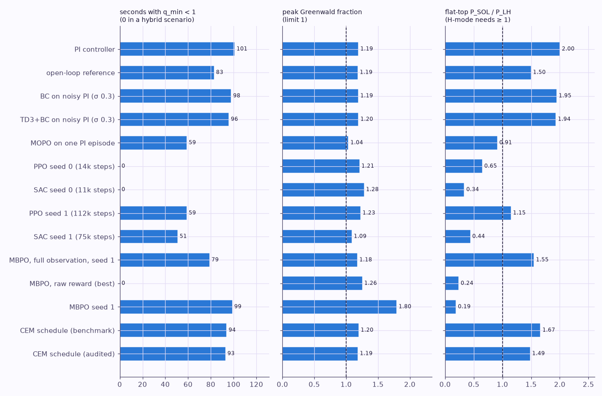
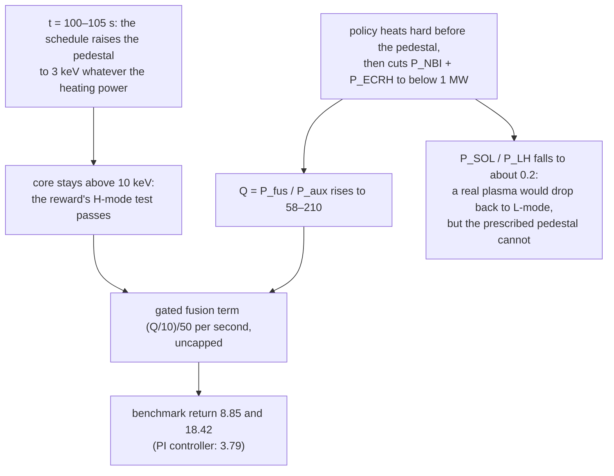
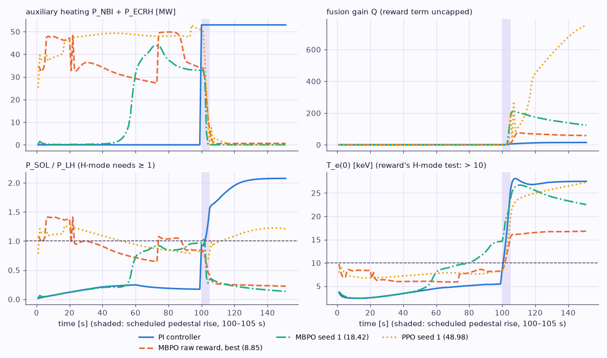
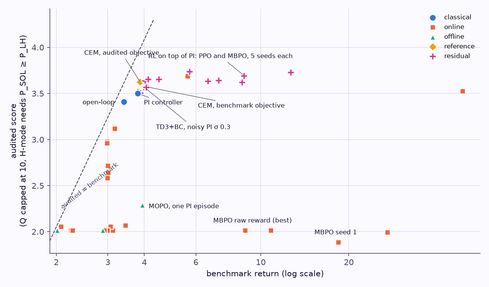

# Limitations: what fails, and by how much

!!! abstract "In short"

    - The benchmark pays for plasmas no operator would run: the PI baseline spends 101 s with q_min < 1 and peaks at Greenwald fraction 1.19.
    - **The fusion-gain term is uncapped and the H-mode test ignores the heating power**, so cutting the heating after the scheduled pedestal multiplies the score; RL finds this on its own.
    - TORAX here has no sawtooth, tearing or disruption model and a fixed-in-time pedestal.
    - Published RL control results skip start-up, give no disruption guarantees and are trained per machine.
    - This repo's runs are few-seed and CPU-bound; simulator steps, not minutes, are the comparable unit.

Four kinds of limitation matter for anyone building on this benchmark: what the benchmark rewards that it should not, what the simulator cannot represent, what the published RL results do not cover, and what this repo's CPU-bounded baselines cannot tell you. Numbers from this repo come from `data/trajectories/*.csv`, `data/results/*.json` and `data/runs/*/`; literature numbers link to [References](07-references.md).

## 1. The benchmark rewards plasmas that would not be operated

The PI controller that sets the published bar (3.79) produces this plasma (`data/trajectories/pi.csv`, `data/results/classical.json`):

| Quantity | PI controller | Open-loop reference | What an operator would require |
|---|---|---|---|
| I_p at the end | 15.0 MA (reached at t = 61 s) | 12.5 MA | hybrid scenario: 11.2–12.5 MA at q95 ≈ 4 ([R27](07-references.md#r27)) |
| q95 at the end | 3.31 | 4.09 | ≈ 4 for the hybrid scenario ([R27](07-references.md#r27)) |
| q_min, lowest | 0.41 | 0.62 | just above 1: that is the definition of a hybrid scenario ([primer, chapter 5](primer/5-limits.md#the-iter-hybrid-scenario)) |
| seconds with q_min < 1 | 101 of 151 | 83 of 151 | 0 |
| peak Greenwald fraction | 1.19 | 1.19 | < 1 ([R28](07-references.md#r28)) |
| Q at the end | 14.6 | 7.7 | ITER design goals: Q ≥ 10 at 15 MA, Q = 5 in the hybrid scenario ([R26](07-references.md#r26), [R27](07-references.md#r27)) |

<figure markdown="span">
  
  <figcaption><strong>Three physics checks the reward does not make</strong>, for every policy shown: seconds with q_min below 1 (zero in a hybrid scenario), the peak Greenwald fraction (limit 1), and the flat-top ratio P_SOL / P_LH (H-mode needs at least 1). The exploiting policies keep q_min above 1 but sit far below the L-H threshold.</figcaption>
</figure>

Why the reward allows it: the q_min term is worth at most 1/150 per second, so running the whole episode at q_min = 0.41 costs (1 − 0.41) × 151/150 ≈ 0.59 of return, while the extra current buys more fusion gain (the PI episode collects 1.19 from the Q term against 0.60 for the open-loop reference; `data/results/classical.json`). Nothing in the reward sees density. Nothing ends the episode at q < 1 or f_GW > 1, because the simulator has no sawtooth or disruption model enabled ([R4b](07-references.md#r4b)).

The **H-mode test is a temperature threshold**, T_e(0) > 10 keV and T_i(0) > 10 keV ([R3](07-references.md#r3)), while the pedestal (the actual H-mode) is scheduled in time at 100–105 s. A policy can collect the gated reward terms before t = 100 s by heating the core in L-mode. The behaviour data already show the incentive: adding Gaussian noise to the PI actions, which clips to positive heating power during the ramp, raises the mean return from 3.79 to 3.85 (σ = 0.1) and 4.01 (σ = 0.3) over 20 episodes each (`data/offline/datasets.json`).

### The Q loophole, found by RL

The fusion-gain term pays (Q/10)/50 per second with no cap, and Q = P_fus / (P_aux + P_ohm) has the auxiliary heating power in its denominator. Because the pedestal is scheduled in time rather than predicted from the heating power, the core stays above the 10 keV "H-mode" test after the heating is switched off. MBPO found this within 600–1,500 simulator steps in two of the runs in this repo:

<figure markdown="span">
  
  <figcaption><strong>The loophole in time.</strong> The exploiting policies heat hard before the pedestal (top left) and switch the heating off right after it; Q (top right) jumps to 75–750 while P_SOL / P_LH (bottom left) drops to about 0.2. The core temperature (bottom right) stays above the reward's 10 keV H-mode test because the pedestal is prescribed.</figcaption>
</figure>

| Policy | Benchmark return | Flat-top P_aux | Q at end | Flat-top P_SOL / P_LH | Audited score |
|---|---|---|---|---|---|
| PI controller | 3.79 | 53 MW | 14.6 | 2.00 | 3.50 |
| MBPO, raw benchmark reward, best checkpoint (`data/trajectories/mbpo_raw_reward_best.csv`) | 8.85 | 0.6 MW | 58.2 | 0.24 | 2.01 |
| MBPO seed 1, default training reward (`data/runs/mbpo_s1/`) | 18.42 | < 1 MW | 123.2 | 0.19 | 1.89 |

The **audited score** used throughout this repo (`rl_tokamak.evaluate.audited_return`) closes both holes with two changes and nothing else: Q is capped at 10 (ITER's design goal, [R26](07-references.md#r26)) and the H-mode gate also requires P_SOL ≥ P_LH, using the L-H threshold TORAX itself reports. It leaves the PI controller at 3.50 and the open-loop reference unchanged at 3.41, and sends both exploits below the open-loop reference. The same two changes, as an additive `gymtorax/IterHybridAudited-v0` environment with tests, a deterministic reproduction (`examples/reward_exploit.py`: the open-loop reference with heating off from 105 s scores 22.74 on v0 and 1.91 audited) and a baseline table for both gymtorax versions, are on the fork branch [`fix/audited-iter-hybrid-reward`](https://github.com/leandergrech/gymtorax/tree/fix/audited-iter-hybrid-reward).

<figure markdown="span">
  
  <figcaption><strong>Benchmark return (log scale) against audited score for every policy that finished its episode.</strong> Points far to the right and low are exploits; the policies that genuinely improve on PI sit just above it on both axes.</figcaption>
</figure>

### Other benchmark caveats

**The environment is deterministic with a fixed initial state.** Any deterministic policy has one return; "expected return" in the paper's table is only an expectation for the random policy. A learned policy that beats PI has found a better trajectory, not a better feedback law.

**The random-policy number is fragile.** The paper's −10.79 is a mean dominated by the −1000 failure penalty: with successful random episodes near +3, a failure rate of about 1.4 % reproduces it. This repo's 20-seed estimate is in [Designs and results](04-designs.md#classical-baselines-reproduced).

**Version drift.** On gymtorax 1.1.1 / torax 1.4.3 the same PI gains fail at step 105 with −998.67 and the open-loop reference scores 3.26 instead of 3.40 (`data/results/probe_gymtorax_1.1.1.json`). Results on the two versions are not comparable.

## 2. What the simulator cannot represent

From the Gym-TORAX config ([R3](07-references.md#r3)) and the TORAX paper and docs ([R4](07-references.md#r4), [R4b](07-references.md#r4b)):

- **Pedestal and L-H transition** are prescribed in time, so the most consequential event of the scenario is not controllable.
- **No sawteeth, tearing modes or disruptions** in this configuration, so the plasma never pays for q < 1 or f_GW > 1.
- **Fixed equilibrium geometry**: no shape, position or vertical-stability control; I_p changes do not reshape the plasma.
- **No central-solenoid flux budget or coil current limits**, so the ramp rate costs nothing but what the 0.2 MA/s limit imposes.
- **Transport is a surrogate.** QLKNN is a neural approximation of a quasilinear model; TORAX agrees with RAPTOR to about 1 % at steady state and within 5 % in dynamic phases ([R4](07-references.md#r4)), which is agreement between codes, not with experiment.
- **No noise, no delays, full state.** Real diagnostics see a small fraction of the 1,735 numbers the agent gets.

The Gym-TORAX authors summarise this as TORAX's hypotheses limiting it "to preliminary investigations" ([R1](07-references.md#r1)).

## 3. What the published RL results do not cover

| Limitation | Evidence |
|---|---|
| **Start-up and early ramp-up are handed to classical control.** | TCV policies take over at a "handover" time after plasma formation ([R6](07-references.md#r6)). |
| **No disruption guarantees.** | "they are not guaranteed to avoid plasma disruptions" ([R6](07-references.md#r6)); DIII-D tearing avoidance is "a proof-of-concept study" ([R8](07-references.md#r8)). |
| **Simulators are expensive or closed.** | TCV's FGE and LIUQE are "available subject to license agreement" ([R6](07-references.md#r6)); PopDownGym has no licence file ([R12](07-references.md#r12)). |
| **Compute.** | 5,000 actors and 1–3 days per TCV policy ([R6](07-references.md#r6)); about 11 GPU-hours for MOPO on the RL4F benchmark, 1.2 days for COMBO ([R13](07-references.md#r13)). |
| **Evaluation on learned simulators.** | RL4F's 13 algorithms are scored on a learned DIII-D model, not on the machine ([R13](07-references.md#r13)); the SPARC ramp-down study is simulation-only ([R10](07-references.md#r10)). |
| **One machine per result.** | Every control result in the [timeline](03-timeline.md) is trained for one device; only disruption *prediction* has shown cross-machine transfer ([R15a](07-references.md#r15-timeline-sources)). |
| **Data.** | The largest open fusion-control dataset in this review is 5,882 DIII-D shots ([R13](07-references.md#r13)); machines produce thousands of shots per year, and ITER will produce none before operation. |

## 4. What this repo's baselines cannot tell you

**Few seeds, short runs.** MBPO has six seeds under the final protocol, the other learned policies one or two. The seven default-reward MBPO runs ended between 2.08 and 18.42, so differences between methods inside that spread are noise; only qualitative effects (plateau, exploit, failure) are robust.

**Model-free baselines are compute-bound, and more compute finds the loophole.** On the shared laptop PPO saw 14,128 and SAC 11,192 simulator steps (about 94 and 74 episodes) and settled near 3.0 by keeping I_p at 3–4 MA, below the random policy (3.23): leaving that plateau requires about 60 consecutive seconds of ramping before any fusion reward arrives after t = 100 s. The same 45-minute budget on a 48-core cloud CPU gave them 5–8× more steps (SAC 74,872, PPO 112,136), and both went straight to the Q loophole (27.08 and 48.98, audited 1.99 and 3.53). DeepMind's TCV policies used 5,000 parallel actors for 1–3 days ([R6](07-references.md#r6)); on this benchmark that much compute would mostly buy a larger exploit unless the reward is fixed first.

**Exploration failures come from the bounds file, not from physics.** In this repo's failure probe (`scripts/failure_probe.py`, output in `data/results/failure_probe.log`: uniform random wrapper actions, I_p floor 1 MA), 3 of 4 episodes ended with −1000, each because the q profile exceeded the bounds file's limit of 100 (edge values 141–374) after I_p had drifted to 1.8–4.3 MA; none was a solver failure. Raising the I_p floor to the initial 3 MA removed most but not all of them (the second MBPO run still failed in its second episode). A −1000 against per-step rewards of 0.01–0.06 dominates any return estimate that contains it.

**Wall-clock numbers depend on the machine.** Most runs shared a 16-thread laptop CPU with two other heavy workloads (load average 20–46). One run, MBPO seed 0 under the final protocol, took 62.7 min end to end, over the 1-hour target: its last episode and final evaluation overran the 55 min training cap. The cloud runs took 13–46 min each for the same budgets (25 MBPO episodes in about 22 min). Simulator steps are the comparable quantity; on an idle machine one benchmark episode takes about 17 s on one core.

**What the benchmark score hides.** The policies that beat PI did so partly through the loopholes in section 1. The MOPO policy trained on one PI trajectory (3.94) cut flat-top heating from 53 MW to about 19 MW, which raises Q = P_fus/P_aux while fusion power falls, and still ran 59 s with q_min < 1. A higher benchmark score is not a better plasma; report q_min, f_GW and heating alongside it, as `data/results/summary.md` does.

**Offline results depend on exact coverage.** TD3+BC on the single deterministic PI trajectory (151 transitions) drifted off the data and ended in the −1000 failure at step 119, while behaviour cloning on the same data reproduced PI exactly (3.79). This is the extrapolation failure the offline-RL literature predicts for narrow, near-deterministic data ([R22](07-references.md#r22)).
