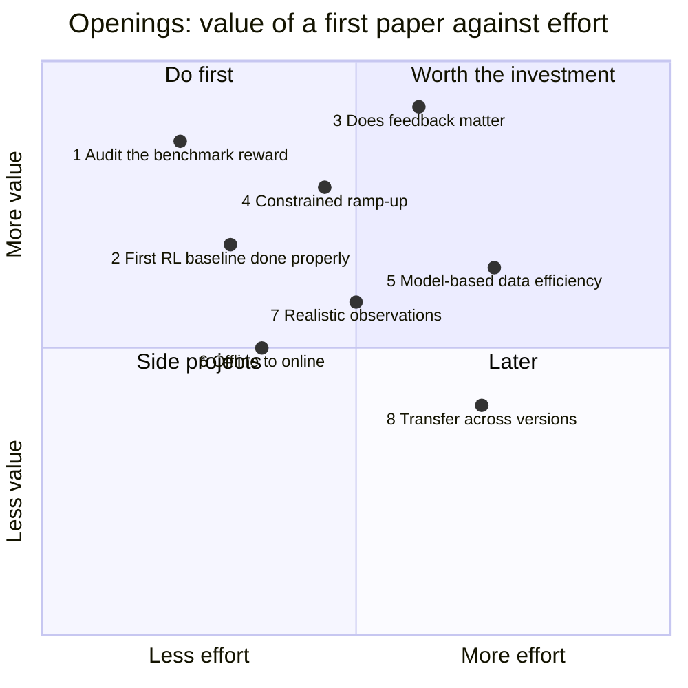

# Open questions you could attack

Ranked by (value of a first paper) × (probability you can deliver it on a laptop CPU in 2–3 months), for someone with your background. Effort assumes the code in this repo as the starting point. Numbers quoted from this repo come from `data/results/summary.json` and are explained in [Designs and results](04-designs.md).

Positions are this repo's judgement, not measurements; the effort estimates under each opening are the basis for the x-axis.

## 1. Audit the benchmark reward before anyone reports "beats PI"

**Why open.** In this repo MBPO reached benchmark returns of 8.85 and 18.42 (the PI controller scores 3.79) by cutting auxiliary heating once the scheduled pedestal keeps the core hot, which inflates the uncapped Q = P_fus/P_aux term ([Limitations](05-limitations.md#the-q-loophole-found-by-rl)). Any RL result on Gym-TORAX 1.0 that does not check for this is uninterpretable. The Gym-TORAX authors describe TORAX-based studies as "preliminary investigations" ([R1](07-references.md#r1)); they do not discuss reward exploits.

**What a first paper would show.** The exploit (mechanism, how quickly each algorithm finds it, how often across seeds), the two-line audit used here (Q capped at 10, H-mode gate requires P_SOL ≥ P_LH, [`audited_return`](04-designs.md#results)), and every baseline re-scored under it, together with CEM's open-loop optimum for both objectives. This is a short, citable note, and a natural thing to send to the Liège authors and to the TORAX discussion ([R5](07-references.md#r5)). The implementation, tests and baseline table are already on the fork branch [`fix/audited-iter-hybrid-reward`](https://github.com/leandergrech/gymtorax/tree/fix/audited-iter-hybrid-reward); draft issue and PR texts are in this repo under `docs/upstream/`.

**Effort.** Days: most of it is done; what remains is review, opening the issue, and more seeds of the exploit-finding runs.

## 2. The first RL baseline on Gym-TORAX, done properly

**Why open.** The benchmark was published in October 2025 with PI, open-loop and random baselines only ([R1](07-references.md#r1)); no RL number has been published on it. This repo's single-seed runs are a first answer, not a publishable one.

**What a first paper would show.** PPO, SAC, MBPO and offline RL on gymtorax 1.0.0 with 5 seeds each, compute reported in CPU-hours and simulator steps, the open-loop optimum as an upper reference (CEM here; gradient-based through TORAX's JAX as a stronger one), the same study repeated on gymtorax 1.1.1 with re-tuned PI gains, and the physics audit of every policy (q_min, f_GW, heating energy; [Limitations](05-limitations.md)). A short benchmark paper (e.g. a workshop or *Software Impacts*-style companion) or a section of opening 3.

**Effort.** 2–3 weeks of compute on one laptop (5 seeds × 6 methods × < 1 h), 1 week of writing.

## 3. Does feedback matter? A randomised Gym-TORAX

**Why open.** Gym-TORAX has a fixed initial state and deterministic dynamics, so its optimal policy is an open-loop schedule ([The control problem](01-problem.md#what-solved-would-mean)). The value of RL for ramp-up control, as opposed to offline trajectory optimisation (which RAPTOR-based work already does on real machines, [R15h](07-references.md#r15-timeline-sources)), only appears when the plasma differs from the model: transport multipliers, initial density and temperature, impurity content, pedestal timing, actuator dropouts.

**What a first paper would show.** A perturbed variant of the ITER hybrid environment (config-level randomisation, no physics changes), and the gap between (a) the best open-loop schedule optimised on the nominal model, (b) the PI controller, (c) MBPO/SAC trained with domain randomisation, evaluated on held-out perturbations. The headline is a curve: return versus perturbation size for each policy class. This is the sim-to-real argument you already make for accelerators, transplanted.

**Effort.** 4–6 weeks. The env subclass is a few hundred lines; `notebooks/03-first-experiment.ipynb` is the scaffold.

## 4. Physics-constrained ramp-up: q_min ≥ 1 and f_GW < 1 as constraints

**Why open.** The benchmark reward lets the PI baseline run 101 s with q_min < 1 (lowest 0.41) and end at Greenwald fraction 1.19 ([Limitations](05-limitations.md)). A hybrid scenario is defined by q_min just above 1 ([R27](07-references.md#r27), [primer §5](02-primer.md#5-the-iter-hybrid-scenario)). No fusion RL paper reports hard-constraint satisfaction; they all shape rewards ([designs](04-designs.md#published-designs-side-by-side)).

**What a first paper would show.** A constrained MDP version (Lagrangian SAC or a safety layer that projects actions using a learned or TORAX-based one-step model), and the Pareto front of benchmark score against constraint violation-seconds. The `qmin_safe` reward mode here is the unconstrained-penalty baseline for it.

**Effort.** 3–5 weeks.

## 5. How much simulator data does model-based RL need? (and can it use TORAX's gradients?)

**Why open.** MBPO's promise, "MBPO's performance on the Ant task at 300 thousand steps matches that of SAC at 3 million steps" ([R19](07-references.md#r19)), has not been measured on a transport simulator. In this repo MBPO exceeded PI's benchmark return in four of seven runs after 1,364–2,416 simulator steps, but mostly through the Q loophole; under the audited reward no MBPO seed reached PI within 25 episodes. The scaling with seeds, model size and rollout length on a reward that cannot be exploited is unknown. TORAX is differentiable end to end ([R4](07-references.md#r4)), so analytic policy gradients through the simulator are also available and untested for control.

**What a first paper would show.** Sample-efficiency curves (return vs simulator steps, 5 seeds) for MBPO, SAC and PPO; the effect of the rollout length k and of exact-physics components (the time feature is already advanced exactly here); and a gradient-through-TORAX baseline.

**Effort.** 4–8 weeks; the JAX gradient part needs familiarity with TORAX internals.

## 6. Offline-to-online from classical-controller logs

**Why open.** Real tokamaks have years of logs from deterministic classical controllers, and offline RL is being benchmarked on 5,882 DIII-D shots ([R13](07-references.md#r13)). Whether offline RL can improve on a deterministic behaviour policy depends on action coverage ([R22](07-references.md#r22)). Gym-TORAX lets you control that coverage exactly, which a real archive does not.

**What a first paper would show.** Offline returns as a function of behaviour noise and dataset size (this repo's `pi_det`, `pi_noisy_0.1`, `pi_noisy_0.3` are the first three points), then how many online episodes offline-to-online fine-tuning needs to beat the behaviour policy.

**Effort.** 3–4 weeks.

## 7. Realistic observations: from profiles to diagnostics

**Why open.** The benchmark observes 1,735 noise-free state numbers. Real control sees a handful of noisy, delayed diagnostics plus a reconstructed equilibrium. All hardware RL results either use raw magnetics with an asymmetric critic ([R6](07-references.md#r6)) or learned models on diagnostic data ([R8](07-references.md#r8)).

**What a first paper would show.** A diagnostic observation set (e.g. I_p, V_loop, line density, a few ECE-like T_e channels, l_i with noise and delay), recurrent or asymmetric actor-critic, and the performance drop relative to full state. Your sparse-noisy-sensor work applies directly.

**Effort.** 3–5 weeks.

## 8. Transfer across simulator versions and machines

**Why open.** Cross-device transfer is the gap every published controller shares ([primer §8](02-primer.md#8-what-has-been-solved-and-what-has-not)). Inside TORAX there are two cheap proxies: gymtorax 1.0 → 1.1 (different TORAX physics and action semantics) and ITER → STEP once UKAEA's public benchmark cases appear ([R5](07-references.md#r5)).

**What a first paper would show.** Zero-shot and few-shot transfer of policies trained on one TORAX configuration to another, against re-training from scratch.

**Effort.** 4–6 weeks, partly blocked on the STEP cases being released.
