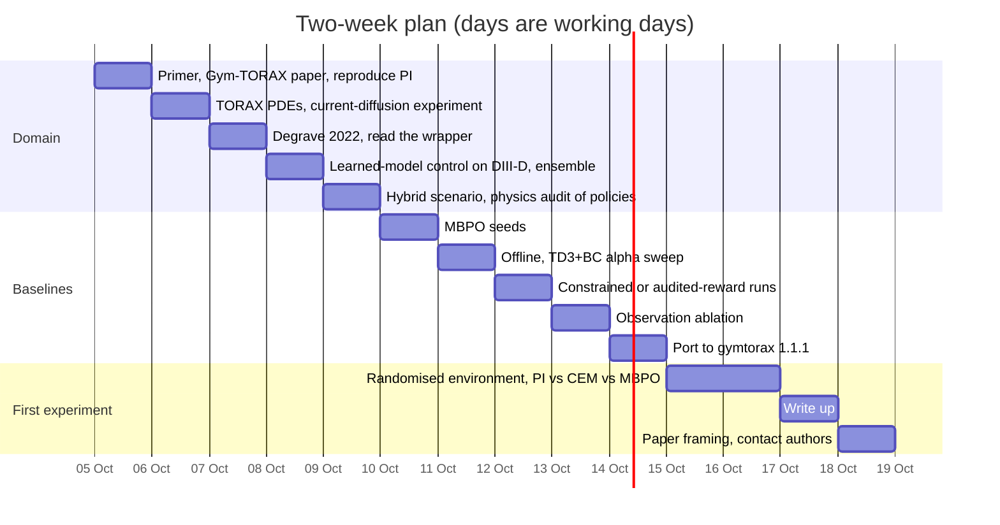

# :rt-onramp: For Leander: on-ramp

!!! abstract "In short"

    **Suggested reading order (about 3 hours):**

    1. This page, then [The control problem](01-problem.md) with the reward explorer.
    2. The [primer](02-primer.md) chapters from the safety factor to the reward, with their animations, then the [Ramp-up Lab](primer/7-lab.md) guided experiments.
    3. [Designs and results](04-designs.md), especially *How every number is produced and checked*.
    4. [Limitations](05-limitations.md) section 1 (the loophole), then [Open questions](06-open-questions.md).

You know the RL side: PPO, SAC and TD3 in SB3, Gymnasium plumbing, sample-efficient learning on an expensive physical system, sim-to-real with sparse noisy sensors, long-horizon safety-constrained decision-making, and inverse problems from images. This page maps that onto the tokamak ramp-up and gives you a two-week plan. The physics is in the [primer](02-primer.md); the MDP in [The control problem](01-problem.md).

## What transfers directly

| Your experience | Where it lands here |
|---|---|
| **RL on an expensive physical system**: sample budgets measured in machine time, model-based and Bayesian methods winning over model-free, a simulator that is useful but wrong | The same structure. TORAX is the "beam-dynamics code" of this problem: fast, open and physically incomplete. The fusion results that reached hardware on profile-level problems all learned a dynamics model first ([designs](04-designs.md#published-designs-side-by-side)). The MBPO baseline here is the family you already trust. |
| **Sim-to-real with sparse, noisy sensors** | The benchmark observes the full plasma state (1,735 numbers, noise-free). Real ramp-ups see magnetics, interferometry, ECE and a reconstructed equilibrium, all noisy and some delayed. The partial-observability opening in [Open questions](06-open-questions.md) is your home ground. |
| **Safety-constrained decision-making** (hard separation constraints, conflict resolution) | q_min ≥ 1, Greenwald fraction < 1 and the L-H power threshold are the hard separation constraints of a ramp-up. The benchmark puts none of them in the reward as a hard constraint, and its PI baseline violates two of them ([Limitations](05-limitations.md)). Constrained RL and safety layers are an obvious contribution. |
| **Super-resolution, inverse problems** | Recovering the current and q profile from external magnetics is equilibrium reconstruction, an ill-posed inverse problem. A learned state estimator is a natural bridge between image-based inverse problems and this domain. |
| **Teaching a Master's AI/ML course** | Gym-TORAX 1.0 on a laptop, with the PI controller as the bar to beat, is a self-contained course project: one episode takes about 17 s on one core. |

## What is new

- **PDE dynamics with separated time scales.** The I_p action is a boundary condition on a diffusion equation for the current, and the "diffusivity" depends on temperature, which your other actions control. Actions show up in the reward 50–100 s later. Plan γ and critic learning accordingly (this repo uses γ = 0.995).
- **Physics vocabulary is dense but finite.** Learn q, q95, q_min, β_N, f_GW, H98, Q, L-/H-mode, sawtooth, tearing mode, disruption. The [primer glossary](primer/8-field.md#glossary) has all of them, and the [equation sheet](primer/equations.md) every formula.
- **The benchmark is deterministic with a fixed initial state.** Any deterministic policy has exactly one return, and the best open-loop schedule is the optimal policy. Beating PI is a trajectory-optimisation result until someone randomises the environment.
- **The reward is a proxy with holes.** "H-mode" means T_e(0) and T_i(0) above 10 keV; the pedestal is scheduled in time; q < 1 costs at most 1/150 per second. Read [Limitations](05-limitations.md) before you optimise hard.
- **Version drift.** The published numbers need gymtorax 1.0.0 + torax 1.0.3; the current gymtorax 1.1.1 gives different returns and the paper's PI gains crash on it.
- **How the community judges results.** Hardware shots, disruption rates and machine-protection arguments count; simulation-only results are "preliminary" (the Gym-TORAX authors' own word for TORAX-based studies).

## Two-week plan

Each day is about 2 hours of reading and 2–4 hours of coding. Commands assume you are in the repo with `.venv-v10` (Python 3.12, `pip install -e .[dev]`) active.

| Day | Read | Do |
|---|---|---|
| 1 | The first three [primer](02-primer.md) chapters and Lab experiments 1–3; Gym-TORAX paper ([R1](07-references.md#r1)) | Run `notebooks/01-explore.ipynb`. Reproduce PI = 3.79 with `python scripts/evaluate.py --classical --n-random 4`. |
| 2 | TORAX paper §II–III ([R4](07-references.md#r4)) and the equation summary ([R4b](07-references.md#r4b)) | Current-diffusion experiment: hold I_p at 3 MA, step it to 5 MA at t = 20 s, plot j(ρ̂) every 5 s. Repeat with 20 MW ECRH on from t = 0 and compare how fast j(0) rises. |
| 3 | Degrave et al. 2022 including Methods ([R6](07-references.md#r6)) | Read `src/rl_tokamak/env.py` end to end. Add a reward mode of your own (e.g. a Greenwald penalty) and a unit test for it. |
| 4 | Seo et al. 2024 ([R8](07-references.md#r8)); Char et al. 2023 ([R15e](07-references.md#r15-timeline-sources)) | Read `agents/mbpo.py` and `agents/ensemble.py`. Measure the ensemble's multi-step prediction error on `data/offline/pi_noisy_0.3.npz` for k = 1, 5, 20. |
| 5 | ITER Research Plan, hybrid scenario sections ([R27](07-references.md#r27)); Van Mulders et al. 2024 ([R15h](07-references.md#r15-timeline-sources)) | Compare `data/trajectories/pi.csv` with the MBPO final episode: seconds with q_min < 1, peak f_GW, heating energy. Write down which of them you would accept as a "hybrid scenario". |
| 6 | MBPO ([R19](07-references.md#r19)), MOPO ([R20](07-references.md#r20)) | Two more MBPO seeds on the audited reward: `python scripts/train.py --algo mbpo --reward-mode patched --out data/runs/mbpo_patched_s3 --seed 3 --real-episodes 25 --minutes 50`. |
| 7 | Kumar et al. 2022 ([R22](07-references.md#r22)); RL4F ([R13](07-references.md#r13)) | TD3+BC α sweep {0.5, 2.5, 10} on `pi_noisy_0.3`; plot return against α next to BC. |
| 8 | Wang et al. 2025, both papers ([R10](07-references.md#r10), [R11](07-references.md#r11)) | Constrained run: `--reward-mode qmin_safe` and a Lagrangian version of your own; plot benchmark score against seconds with q_min < 1. |
| 9 | Tracey et al. 2023 ([R7](07-references.md#r7)) | Observation ablation with a second seed each (`--obs-set scalars|full`). |
| 10 | Kates-Harbeck et al. 2019 ([R15a](07-references.md#r15-timeline-sources)); PACMAN ([R9](07-references.md#r9)) | Port the wrapper to gymtorax 1.1.1 in a separate venv (action semantics changed; observation keys split per species) and re-tune the PI gains there. |
| 11–12 | TORAX config docs for `transport`, `pedestal`, `profile_conditions` | First experiment, `notebooks/03-first-experiment.ipynb`: randomise transport and initial conditions, compare PI, the CEM open-loop schedule and MBPO. |
| 13 | — | Write up results with seeds and compute; regenerate `data/results/summary.md`. |
| 14 | TORAX discussion #1625 ([R5](07-references.md#r5)) | Decide the framing of the first paper (see [Open questions](06-open-questions.md)); consider contacting the Liège authors and posting on the TORAX discussion. |
