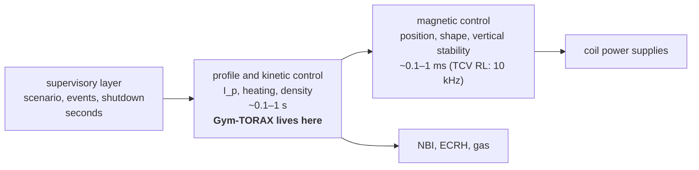

# :rt-machine: The machine as a control system

!!! abstract "The question"

    What is being controlled, with what, and where does the Gym-TORAX task sit among the control loops of a real tokamak?

## A ring of plasma held by two magnetic fields

A tokamak holds a ring (torus) of hydrogen plasma inside a vacuum vessel using magnetic fields. Core temperatures are tens of keV (1 keV ≈ 11.6 million K); the PI rollout in this repo reaches T_e(0) ≈ 27 keV. Two field components matter:

- the **toroidal field** B_φ, the long way round the ring, made by large superconducting coils and essentially fixed during a pulse (5.3 T at ITER's plasma centre, R = 6.2 m; [R3](../07-references.md#r3), [R26](../07-references.md#r26));
- the **poloidal field** B_θ, the short way round, made mainly by a current I_p flowing in the plasma itself (15 MA in ITER's baseline scenario; [R26](../07-references.md#r26)).

Together they make field lines that wind helically around the torus. Raise the current below and watch the edge field lines twist faster: that twist is [the safety factor q](2-safety-factor.md).

## The actuators the agent has

The plasma current is driven like the secondary of a transformer: a **central solenoid** in the hole of the torus ramps its own current, and the changing flux induces a loop voltage V_loop around the plasma. The solenoid can only swing its current so far, so each pulse has a finite **flux budget**, measured in volt-seconds. Spending it fast during the ramp-up leaves less for the flat-top; ITER's research plan says operation at 15 MA "requires the full capabilities of the central solenoid and optimization of the current ramp-up/down together with the use of additional heating" ([R27](../07-references.md#r27)). Gym-TORAX does not model the solenoid or the flux budget; it takes I_p as a directly commanded boundary condition. (The Lab reports the resistive flux a trajectory draws, for comparison: .)

Heating sources on top of the ohmic (resistive) heating from I_p:

- **NBI** (neutral beam injection): beams of fast neutral atoms that ionise inside the plasma, heat it, fuel it, push it round toroidally, and drive some current. In Gym-TORAX: up to 33 MW, Gaussian deposition, current drive proportional to power (1 MA per 16 MW in the reference code).
- **ECRH / ECCD** (electron cyclotron resonance heating / current drive): microwaves absorbed where the wave frequency matches the electron gyrofrequency, which gives very localised heating and current drive whose radius can be steered. Up to 20 MW here.

| Actuator | Gym-TORAX action | Bounds | What it changes first |
|---|---|---|---|
| Central solenoid (via I_p) | `Ip` set-point [A] | 3 MA floor in this repo's wrapper … 15 MA, at most 0.2 MA per 1 s step | the edge boundary condition of the current-diffusion equation ([How the current gets in](3-current-diffusion.md)) |
| Neutral beams | `NBI` power, deposition centre, width | 0–33 MW | ion and electron heating, density (fuelling), driven current |
| Electron cyclotron | `ECRH` power, deposition centre, width | 0–20 MW | electron heating at one radius, a little driven current |

## Layers of control, and where this task sits

Control in real tokamaks is layered: fast magnetic control of position and shape (kHz, the problem DeepMind solved on TCV), slower control of the current and pressure profiles and of the density (tens of ms to s), and a supervisory layer handling events and shutdown. The Gym-TORAX task sits in the second layer, at 1 s resolution, with the shape fixed.

!!! tip "What it means for the agent"

    - **The state is a PDE state.** Four radial profiles (T_i, T_e, n_e and the poloidal flux ψ) evolve between decisions; everything in the observation is derived from them ([The control problem](../01-problem.md#state)).
    - **The action is three numbers per second** in this repo's wrapper: a current ramp rate and two powers. The deposition locations are fixed unless you use `--action-set full`.
    - **Nothing about the machine changes between episodes.** Same shape, same initial plasma, deterministic dynamics. The value of a policy is the value of one trajectory.

??? question "Check yourself (click to open)"

    1. Which field does the agent control, B_φ or B_θ? *B_θ, through I_p. B_φ is fixed by the coils.*
    2. Why can't a real controller ramp I_p as fast as it likes? *The solenoid's flux swing and voltage are finite, and a fast ramp makes a hollow current profile ([How the current gets in](3-current-diffusion.md)). Gym-TORAX enforces only the 0.2 MA/s rate limit.*
    3. Which actuator would you use to put current at one specific radius? *ECCD: its deposition is narrow and steerable.*

[Next: the safety factor q →](2-safety-factor.md)
